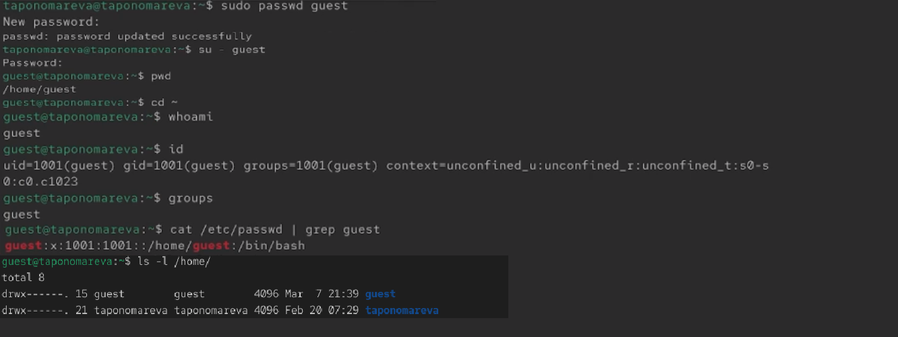
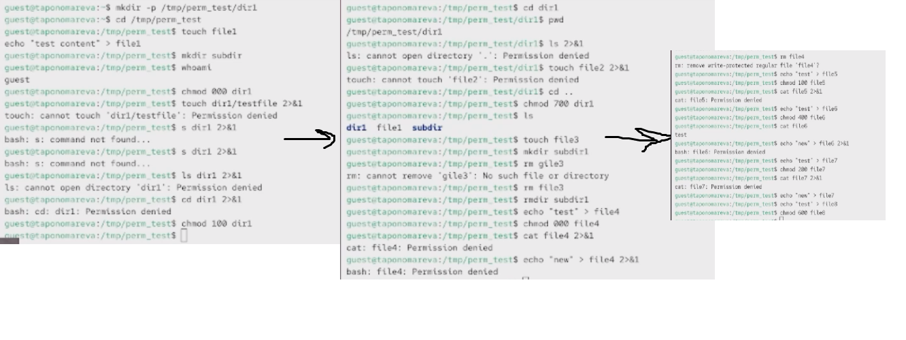
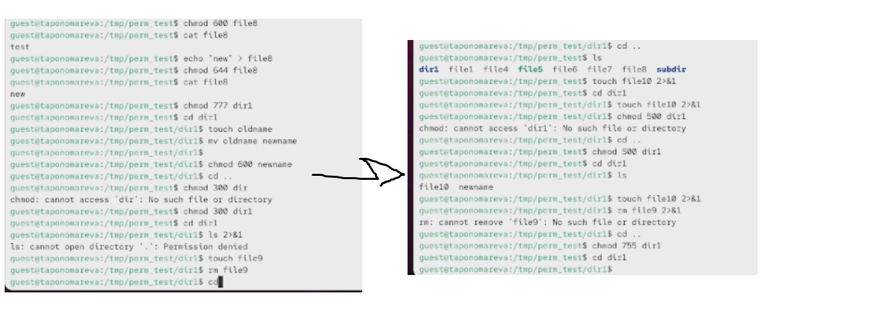

---
## Author
author:
  name: Татьяна Александровна Пономарева
  affiliation:
    - name: Российский университет дружбы народов
      country: Российская Федерация
      postal-code: 115419
      city: Москва
      address: ул. Орджоникидзе, д. 3
## Title
title: Презентация по лабораторной работе номер 2
subtitle: Основы информационной безопасности
license: CC BY
date: today
date-format: "YYYY-MM-DD" # Example: 2025-09-06
---

# Информация

## Докладчик

:::::::::::::: {.columns align=center}
::: {.column width="55%"}

  * Пономарева Татьяна Александровна
  * Студент группы НКАбд-04-24
  * Российский университет дружбы народов им. П. Лумумбы
  * [taponomareva6742@gmail.com](mailto:taponomareva6742@gmail.com)
  * <https://github.com/taponomareva>

:::
::: {.column width="30%"}

:::
::::::::::::::

# Вводная часть

## Цель работы

Получение практических навыков работы в консоли с атрибутами файлов,закрепление теоретических основ дискреционного разграничения доступа в современных системах с открытым кодом на базе ОС Linux. 

## Задание

Добавить пользователя guest, задать пароль, войти в систему под новым пользователем, определить директорию, уточнить имя пользователя, уточнить группу, а также группы, в которых есть пользователь, сравнить полученную информацию с данными, выводимыми в командной строке, просмотреть файлы командами, определить gid пользователя, сравнить найденные значения, определить существование директорий, проверить расширенные атрибуты, создать поддиректорию dir1, снять с директории права,создать файл в той же директории, выполнить задания с таблицами.

## Теоретическое введение

Дискреционное управление доступом в ОС Linux обеспечивает возможность управления доступом к данным самими пользователями операционной системы, также оно применяется к каждому субъекту (пользователю) и сущности (файлу, каталогу).

Механизм дискреционного управления доступом именованных субъектов к именованным сущностям обеспечивает создание для каждой пары субъект-сущность явного и недвусмысленного перечисления разрешенных типов доступа, формирующих правила разграничения доступа (ПРД) [@astralinux-dac].

# Выполнение лабораторной работы

## Выполнение заданий

Сначала добавляю пользователя guest, задатю пароль, вхожу в систему под новым пользователем, определяю директорию, уточняю имя пользователя при whoami, уточнияю группу, а также группы, в которых есть пользователь, сравнию полученную информацию с данными, выводимыми в командной строке, просматриваю файлы командами, определяю gid пользователя (он равен 1001), сравнию найденные значения, определяю существование директорий, проверяю расширенные атрибуты,создаю поддиректорию dir1, снимаю с директории права,создаю файл в той же директории ([рис. @fig-001]).

{#fig-001 width=70%}

## Выполнение заданий с правами доступа часть 1

Дальше выполняю задания, связанные с правами доступа ([рис. @fig-002]).

{#fig-002 width=70%}

## Выполнение заданий с правами доступа часть 2

Затем далее выполняю задания, связанные с правами доступа ([рис. @fig-003]).

{#fig-003 width=70%}

Далее таблицы по заданиям 14-15 
Задание 14. В таблице [табл. @tbl-perm-actions] можно видеть установленные права и разрешённые действия
: Установленные права и разрешённые действия {#tbl-perm-actions}

| Права директории | Права файла | Создание файла | Удаление файла | Запись в файл | Чтение файла | Смена директории | Просмотр файлов в директории | Переименование файла |
|:-----------------|:------------|:--------------:|:--------------:|:-------------:|:------------:|:----------------:|:----------------------------:|:--------------------:|
| d (000)          | (000)       |       −        |       −        |       −       |      −       |        −         |              −               |          −           |
| d (000)          | rwx (700)   |       −        |       −        |       −       |      −       |        −         |              −               |          −           |
| d--x--x--x (100) | (000)       |       −        |       −        |       −       |      −       |        +         |              −               |          −           |
| d--x--x--x (100) | rwx (700)   |       −        |       −        |       −       |      −       |        +         |              −               |          −           |
| drwx------ (700) | (000)       |       +        |       +        |       −       |      −       |        +         |              +               |          +           |
| drwx------ (700) | rw------- (600) |   +        |       +        |       +       |      +       |        +         |              +               |          +           |
| drwx------ (700) | r-------- (400) |   +        |       +        |       −       |      +       |        +         |              +               |          +           |
| drwx------ (700) | -w------- (200) |   +        |       +        |       +       |      −       |        +         |              +               |          +           |
| dr-x------ (500) | rw------- (600) |   −        |       −        |       +       |      +       |        +         |              +               |          −           |
| d-wx------ (300) | rw------- (600) |   +        |       +        |       −       |      −       |        +         |              −               |          +           |
| drwxr-xr-x (755) | rw-r--r-- (644) |   +        |       +        |       +       |      +       |        +         |              +               |          +           |
| drwxrwxrwx (777) | любые       |       +        |       +        |    зависит    |   зависит    |        +         |              +               |          +           |

Задание 15. В таблице [табл. @tbl-min-perm] можно какие операции дают мин права на директорию и на файл
| Операция                  | Минимальные права на директорию | Минимальные права на файл |
|:--------------------------|:-------------------------------:|:-------------------------:|
| Создание файла            |              wx (300)           |      — (не существует)    |
| Удаление файла            |              wx (300)           |      — (не требуются)     |
| Чтение файла              |               x (100)           |           r (400)         |
| Запись в файл             |               x (100)           |           w (200)         |
| Переименование файла      |              wx (300)           |      — (не требуются)     |
| Создание поддиректории    |              wx (300)           |            —              |
| Удаление поддиректории    |              wx (300)           |            —              |
| Смена директории (cd)     |               x (100)           |            —              |
| Просмотр файлов в директории (ls) |        rx (500)           |            —              |

: Минимальные права для совершения операций {#tbl-min-perm}

## Выводы

В ходе проведения лабораторной работы были получены знания по правам доступа в файлах и директориях.

# Список литературы{.unnumbered}

::: {#refs}
:::
