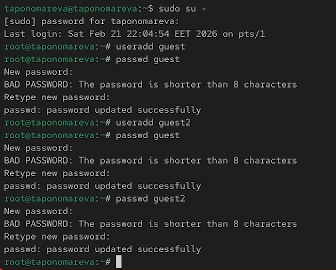
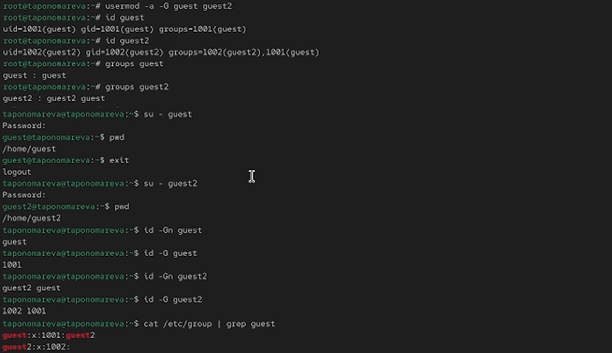
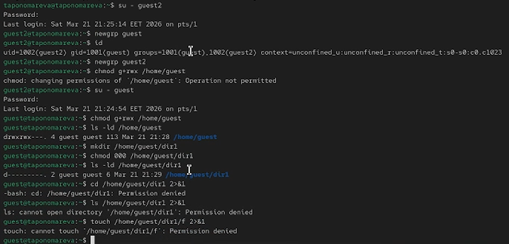

---
## Author
author:
  name: Татьяна Александровна Пономарева
  affiliation:
    - name: Российский университет дружбы народов
      country: Российская Федерация
      postal-code: 115419
      city: Москва
      address: ул. Орджоникидзе, д. 3

## Title
title: "Отчёт по лабораторной работе №3"
subtitle: "Основы информационной безопасности"
license: "CC BY"
---

# Цель работы

Получение практических навыков работы в консоли с атрибутами файлов для групп пользователей.

# Задание

Добавить пользователей guest и guest2, задать пароли, добавить guest2 в группу guest, войти в систему от двух пользователей на разных консолях, определить директории, уточнить имена пользователей, группы и групповое членство, сравнить вывод команд groups, id -Gn и id -G с содержимым /etc/group, выполнить регистрацию guest2 в группе guest командой newgrp, изменить права директории /home/guest для группы, снять атрибуты с dir1, изменяя атрибуты у dir1 и файла file1 от имени guest и делая проверку от guest2 заполнить табл. 3.1, на основании таблицы определить минимально необходимые права для выполнения операций guest2 внутри dir1 и заполнить табл. 3.2.

# Теоретическое введение

Дискреционное управление доступом в ОС Linux обеспечивает возможность управления доступом к данным самими пользователями операционной системы, также оно применяется к каждому субъекту (пользователю) и сущности (файлу, каталогу).

Механизм дискреционного управления доступом именованных субъектов к именованным сущностям обеспечивает создание для каждой пары субъект-сущность явного и недвусмысленного перечисления разрешенных типов доступа, формирующих правила разграничения доступа (ПРД).

На защищаемые именованные сущности при их создании автоматически устанавливаются базовые дискреционные ПРД в виде:

+ идентификаторов пользователя-владельца (UID) и группы-владельца (GID), которые вправе распоряжаться доступом к данной сущности;
+ прав доступа данных субъектов к созданной сущности.

Сущностями доступа являются:файлы,каталоги, соединения (сокеты), сетевые пакеты, механизмы IPC (разделяемая память, очереди сообщений и др.) [@astralinux-dac].

# Выполнение лабораторной работы

Сначала добавляю пользователей guest и guest2 и задаю пароли ([рис. @fig-001]).

{#fig-001 width=70%}

Потом добавить guest2 в группу guest, войти в систему от двух пользователей на разных консолях, определить директории, уточнить имена пользователей, группы и групповое членство, сравнить вывод команд groups, id -Gn и id -G с содержимым /etc/group ([рис. @fig-002]).

{#fig-002 width=70%}

Далее выполняю регистрацию guest2 в группе guest командой newgrp, изменияю права директории /home/guest для группы, снимаю атрибуты с dir1 ([рис. @fig-003]).

{#fig-003 width=70%}

Задание 3.1. В таблице [табл. @tbl-perm-actions] можно видеть установленные права и разрешённые действия

| Права директории | Права файла | Создание файла | Удаление файла | Запись в файл | Чтение файла | Смена директории | Просмотр файлов в директории | Переименование файла |
|:-----------------|:------------|:--------------:|:--------------:|:-------------:|:------------:|:----------------:|:----------------------------:|:--------------------:|
| d (000)          | (000)       |       -        |       -        |       -       |      -       |        -         |              -               |          -           |
| d (000)          | rwx (070)   |       -        |       -        |       -       |      -       |        -         |              -               |          -           |
| d--x--x--- (010) | (000)       |       -        |       -        |       -       |      -       |        +         |              -               |          -           |
| d--x--x--- (010) | rwx (070)   |       -        |       -        |       -       |      -       |        +         |              -               |          -           |
| drwxrwx--- (070) | (000)       |       +        |       +        |       -       |      -       |        +         |              +               |          +           |
| drwxrwx--- (070) | rw-rw---- (060) |   +        |       +        |       +       |      +       |        +         |              +               |          +           |
| drwxrwx--- (070) | r-------- (040) |   +        |       +        |       -       |      +       |        +         |              +               |          +           |
| drwxrwx--- (070) | -w------- (020) |   +        |       +        |       +       |      -       |        +         |              +               |          +           |
| dr-xr-x--- (050) | rw-rw---- (060) |   -        |       -        |       +       |      +       |        +         |              +               |          -           |
| d-wxrwx--- (030) | rw-rw---- (060) |   +        |       +        |       -       |      -       |        +         |              -               |          +           |
| drwxr-xr-x (075) | rw-rw-r-- (064) |   +        |       +        |       +       |      +       |        +         |              +               |          +           |

: Установленные права и разрешённые действия {#tbl-perm-actions}

Задание 3.2. В таблице [табл. @tbl-min-perm] можно видеть, какие операции дают мин права на директорию и на файл

| Операция                  | Минимальные права на директорию | Минимальные права на файл |
|:--------------------------|:-------------------------------:|:-------------------------:|
| Создание файла            |              rwx (070)          |      — (не существует)    |
| Удаление файла            |              rwx (070)          |      — (не требуются)     |
| Чтение файла              |               --x (010)         |           r-- (040)       |
| Запись в файл             |               --x (010)         |           -w- (020)       |
| Переименование файла      |              rwx (070)          |      — (не требуются)     |
| Создание поддиректории    |              rwx (070)          |            —              |
| Удаление поддиректории    |              rwx (070)          |            —              |
| Смена директории (cd)     |               --x (010)         |            —              |
| Просмотр файлов в директории (ls) |        r-x (050)           |            —              |

: Минимальные права для совершения операций {#tbl-min-perm}

Задание 3.3. В таблице [табл. @tbl-compare] можно видеть сравнение двух таблиц

| Операция | Таблица 2.1 (владелец) | | Таблица 3.1 (группа) | |
|:---------|:----------------------:|:-:|:--------------------:|:-:|
| | Директория | Файл | Директория | Файл |
| Создание файла | wx (300) | — | rwx (070) | — |
| Удаление файла | wx (300) | — | rwx (070) | — |
| Чтение файла | x (100) | r (400) | --x (010) | r-- (040) |
| Запись в файл | x (100) | w (200) | --x (010) | -w- (020) |
| Переименование файла | wx (300) | — | rwx (070) | — |
| Смена директории | x (100) | — | --x (010) | — |
| Просмотр директории | rx (500) | — | r-x (050) | — |

: Сравнение таблиц из 2 и 3 лабораторных работ {#tbl-compare}

# Выводы

В ходе проведения лабораторной работы были получены знания по работе в консоли с атрибутами файлов для групп пользователей.

# Список литературы{.unnumbered}

::: {#refs}
:::
