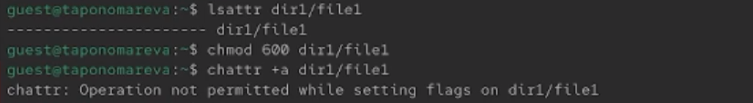
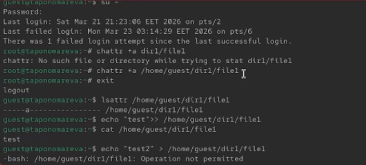
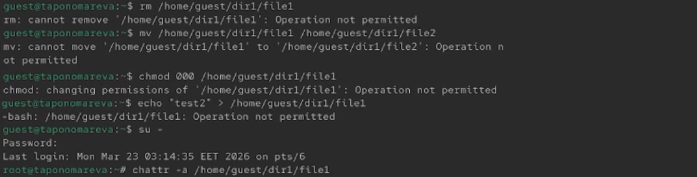
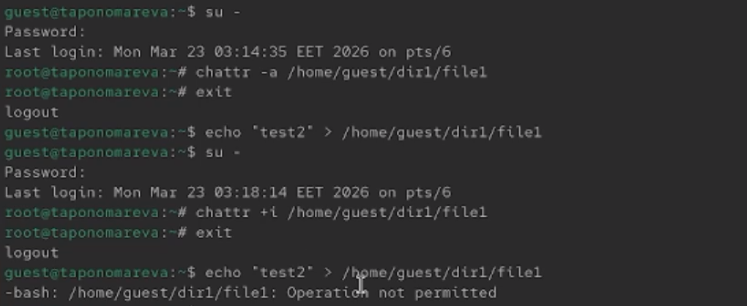

---
## Author
author:
  name: Татьяна Александровна Пономарева
  affiliation:
    - name: Российский университет дружбы народов
      country: Российская Федерация
      postal-code: 115419
      city: Москва
      address: ул. Орджоникидзе, д. 3

## Title
title: "Отчёт по лабораторной работе №4"
subtitle: "Основы информационной безопасности"
license: "CC BY"
---

# Цель работы

Получение практических навыков работы в консоли с расширенными атрибутами файлов.

# Задание

Определить расширенные атрибуты файла /home/guest/dir1/file1 от имени пользователя guest, установить на файл права 600, попытаться установить расширенный атрибут «a» от пользователя guest, зайти с правами администратора и установить атрибут «a» от имени суперпользователя, проверить правильность установки атрибута от пользователя guest, выполнить дозапись в файл слова «test» и прочитать его содержимое, попытаться удалить файл, стереть информацию (перезаписать), переименовать файл и изменить права командой chmod 000, снять расширенный атрибут «a» от имени суперпользователя, заменить атрибут «a» атрибутом «i», проверить возможность дозаписи.

# Теоретическое введение

Дискреционное управление доступом в ОС Linux обеспечивает возможность управления доступом к данным самими пользователями операционной системы, также оно применяется к каждому субъекту (пользователю) и сущности (файлу, каталогу).

Механизм дискреционного управления доступом именованных субъектов к именованным сущностям обеспечивает создание для каждой пары субъект-сущность явного и недвусмысленного перечисления разрешенных типов доступа, формирующих правила разграничения доступа (ПРД).

На защищаемые именованные сущности при их создании автоматически устанавливаются базовые дискреционные ПРД в виде:

+ идентификаторов пользователя-владельца (UID) и группы-владельца (GID), которые вправе распоряжаться доступом к данной сущности;
+ прав доступа данных субъектов к созданной сущности.

Сущностями доступа являются:файлы,каталоги, соединения (сокеты), сетевые пакеты, механизмы IPC (разделяемая память, очереди сообщений и др.) [@astralinux-dac].

# Выполнение лабораторной работы

Определяем расширенные атрибуты файла /home/guest/dir1/file1 от имени пользователя guest, устанавливаем на файл права 600, пытаемся установить расширенный атрибут «a» от пользователя guest, что не удается сделать, т к нет прав ([рис. @fig-001]).

{#fig-001 width=70%}

Заходим с правами администратора и устанавливаем атрибут «a» от имени суперпользователя, проверяем правильность установки атрибута от пользователя guest, выполняем дозапись в файл слова «test» и читаем его содержимое ([рис. @fig-002]).

{#fig-002 width=70%}

Пробуем удалить файл, стереть информацию (перезаписать), переименовать файл и изменить права командой chmod 000, снять расширенный атрибут «a» от имени суперпользователя ([рис. @fig-003]).

{#fig-003 width=70%}

Затем снимаем расширенный атрибут «a» от имени суперпользователя, делаем перезапись файла, заменяем атрибут «a» атрибутом «i», проверяем возможность дозаписи, что не получается сделать ([рис. @fig-004]).

{#fig-004 width=70%}

# Выводы

В ходе проведения лабораторной работы были получены навыки работы в консоли с расширенными атрибутами файлов.

# Список литературы{.unnumbered}

::: {#refs}
:::
