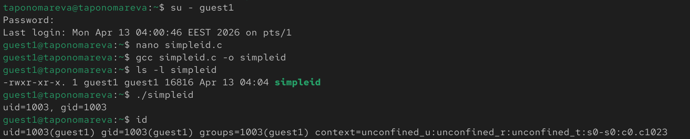
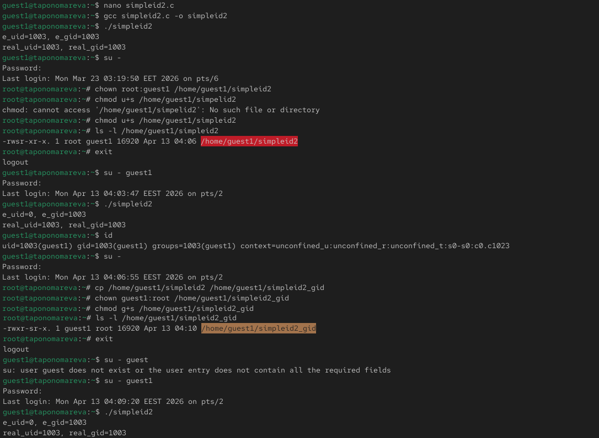
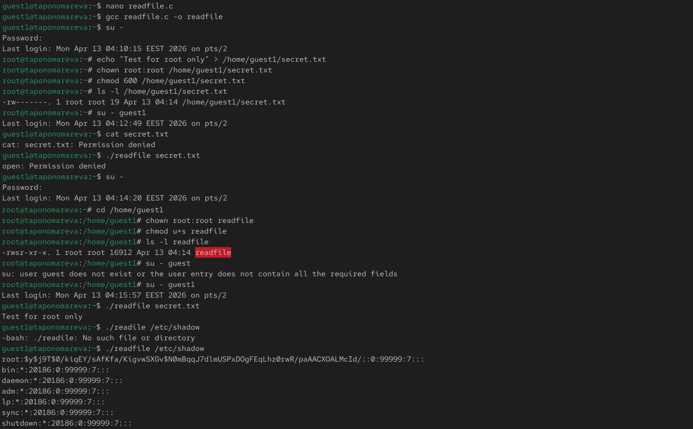
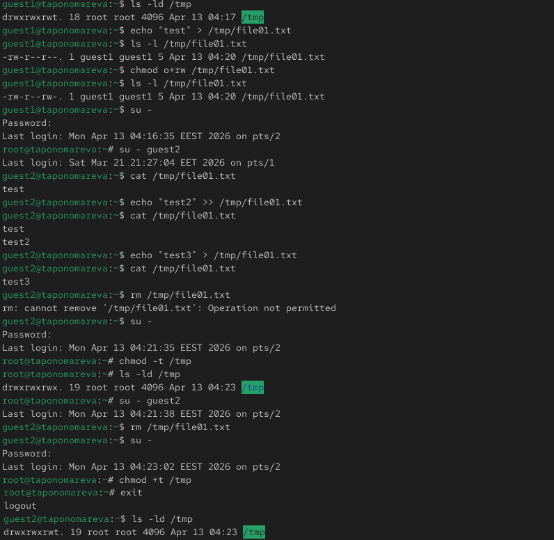

---
## Author
author:
  name: Татьяна Александровна Пономарева
  affiliation:
    - name: Российский университет дружбы народов
      country: Российская Федерация
      postal-code: 115419
      city: Москва
      address: ул. Орджоникидзе, д. 3

## Title
title: "Отчёт по лабораторной работе №5"
subtitle: "Основы информационной безопасности"
license: "CC BY"
---

# Цель работы

Изучение механизмов изменения идентификаторов, применения SetUID- и Sticky-битов. Получение практических навыков работы в консоли с дополнительными атрибутами. Рассмотрение работы механизма смены идентификатора процессов пользователей, а также влияние бита Sticky на запись и удаление файлов.

# Задание

Создать программы simpleid.с, simpleid2.с, readfile.c, прокомпилировать их и запустить, проверить, чем отличается simpleid от id, и на simpleid2 сделать SUID-бит, сравнить simpleid2 и id. Установить права на файл readfile, чтобы суперпользователь мог прочитать его, а guest1 не мог. Сменить у программы readfile владельца и установить SetUID-бит. Проверить программу readfile на чтение файла readfile.c и файла /etc/shadow, наличие атрибута Sticky на директории /tmp. От имени пользователя guest1 создать файл file01.txt в директории /tmp со словом test, посмотреть атрибуты file01.txt и разрешить чтение и запись для категории пользователей "все остальные". От пользователя guest2 проверить на чтение файла /tmp/file01.txt и дозаписи в него. Проверить содержимое файла file01.txt. Попробовать удалить файл file01.txt, убрать Sticky-бит и проверить на отсутствие t. От пользователя guest2 удалить file01.txt. В режиме суперпользователя вернуть атрибут t на директорию /tmp.

# Теоретическое введение

Дискреционное управление доступом в ОС Linux обеспечивает возможность управления доступом к данным самими пользователями операционной системы, также оно применяется к каждому субъекту (пользователю) и сущности (файлу, каталогу).

Механизм дискреционного управления доступом именованных субъектов к именованным сущностям обеспечивает создание для каждой пары субъект-сущность явного и недвусмысленного перечисления разрешенных типов доступа, формирующих правила разграничения доступа (ПРД).

На защищаемые именованные сущности при их создании автоматически устанавливаются базовые дискреционные ПРД в виде:

1. идентификаторов пользователя-владельца (UID) и группы-владельца (GID), которые вправе распоряжаться доступом к данной сущности;
2. прав доступа данных субъектов к созданной сущности.

Сущностями доступа являются:файлы,каталоги, соединения (сокеты), сетевые пакеты, механизмы IPC (разделяемая память, очереди сообщений и др.) [@astralinux-dac].

# Выполнение лабораторной работы

Сначала заходим от лица пользователя guest1, создаем программу simpleid.с, компилируем программу и проверяем, что файл программы создан, выполняем программу simpleid и системную программу id, сравниваем их и видим, что значения id совпадают ([рис. @fig-001]).

{#fig-001 width=100%}

Далее усложняем программу simpleid.c и создаем simpleid2.с, компилируем и запускаем. Потом от имени суперпользователя (при помощи команды su -) выполняем команду смены пользователя и устанавливаем SUID-бит, проверяем правильность установки новых атрибутов и смены пользователя. Запускаем simpleid2 и id. Получаем, что эффективный UID (e_uid) будет равен 0 (root), а реальный UID (real_uid) равняется 1003, т. к. программа выполнилась с правами владельца файла (root), проделываем тоже самое относительно SetGID-бита ([рис. @fig-002]).

{#fig-002 width=100%}

Затем создаем программу readfile.c, компилируем ее, меняем владельца у файла readfile.c и изменяем права так, чтобы только суперпользователь мог прочитать его, а guest1 не мог. Имеем, что пользователь guest1 не может прочитать файл readfile.c, сменяем у программы readfile владельца и устанавливаем SetUID-бит, также имеем,что программа readfile может читать файл readfile.c и файл /etc/shadow, т. к. уязвимость SUID-программ позволяет обычному пользователю читать системные файлы ([рис. @fig-003]).

{#fig-003 width=100%}

Заметим, что атрибут Sticky на директории /tmp установлен, т. к. в конце стоит t. От имени пользователя guest1 создаем файл file01.txt в директории /tmp со словом test, смотрим атрибуты file01.txt и разрешаем чтение и запись для категории пользователей "все остальные". От пользователя guest2 можно читать файл /tmp/file01.txt и дозаписывать в него. Проверяем содержимое файла и получаем, что в нем записано test test2. После перезаписи имеем в файле только test3. Пробуем удалить файл file01.txt, на что нет разрешения, поэтому удалить его не можем. Переходим в режим суперпользователя, убираем Sticky-бит и проверяем на отсутствие t (Sticky-бит убран). От пользователя guest2 успешно удаляем file01.txt. В режиме суперпользователя возвращаем атрибут t на директорию /tmp ([рис. @fig-004]).

{#fig-004 width=100%}

# Выводы

В ходе проведения лабораторной работы были изучены механизмы изменения идентификаторов, применения SetUID- и Sticky-битов и были получены практические навыки работы в консоли с дополнительными атрибутами, а также были рассмотрены работы механизма смены идентификатора процессов пользователей и влияние бита Sticky на запись и удаление файлов.

# Список литературы{.unnumbered}

::: {#refs}
:::
