---
## Author
author:
  name: Татьяна Александровна Пономарева
  affiliation:
    - name: Российский университет дружбы народов
      country: Российская Федерация
      postal-code: 115419
      city: Москва
      address: ул. Орджоникидзе, д. 3

## Title
title: "Отчёт по лабораторной работе №6"
subtitle: "Основы информационной безопасности"
license: "CC BY"
---
# Цель работы

Развить навыки администрирования ОС Linux. Получить первое практическое знакомство с технологией SELinux. Проверить работу SELinux на практике совместно с веб-сервером Apache.

# Задание

Проверка режима SELinux и работы веб-сервера Apache, определение контекста безопасности процессов httpd, просмотр булевых переключателей SELinux для Apache, просмотр статистики политики и определение количества пользователей, ролей и типов, определение типов файлов в директории /var/www и проверка прав на создание файлов в /var/www/html, создание тестового HTML-файла и проверка его контекста, изменение контекста файла на samba_share_t и проверка запрета доступа к нему через браузер с анализом логов SELinux, изменение порта Apache на 81 и проверка работы сервера, добавление порта 81 в политику SELinux и перезапуск веб-сервера, возврат контекста httpd_sys_content_t файлу и проверка доступа через браузер, восстановление порта 80 в конфигурации Apache и удаление тестового файла.

# Теоретическое введение

SELinux (Security Enhanced Linux) - это система Mandatory Access Control, построенная на LSM (Linux Security Modules). На практике ядро запрашивает SELinux перед каждой системой, чтобы узнать, уполномочен ли этот процесс делать данную операцию. SELinux использует набор правил — коллективно известный как политика —, чтобы санкционировать или запретить операции [@selinux_info].

# Выполнение лабораторной работы

Сначала проверяем режим SELinux и работу веб-сервера, все работает ([рис. @fig-001]).

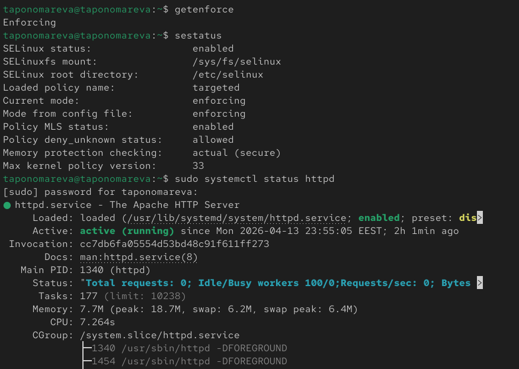{#fig-001 width=70%}

Находим процессы httpd с контекстами ([рис. @fig-002]).

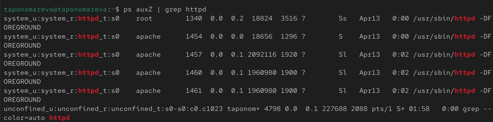{#fig-002 width=70%}

Смотрим булевы переключатели httpd ([рис. @fig-003]).

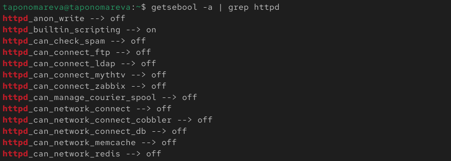{#fig-003 width=70%}

При помощи команды seinfo просматриваем общую информацию о политике ([рис. @fig-004]).

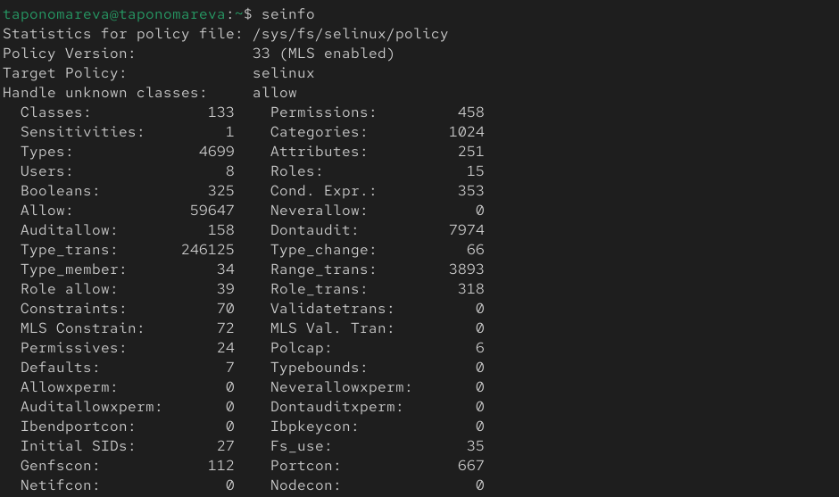{#fig-004 width=70%}

Потом смотрим количество пользователей, ролей и типов ([рис. @fig-005]).

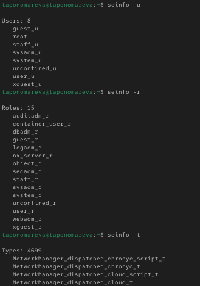{#fig-005 width=70%}

Проверяем контексты директории /var/www и в html. Далее смотрим владельца и права и создаем тестовый файл и проверяем контекст ([рис. @fig-006]).

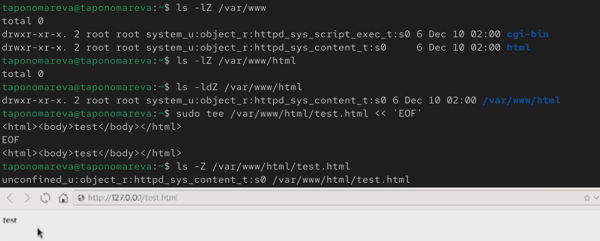{#fig-006 width=70%}

Проверяем контексты директории /var/www и в html. Далее смотрим владельца и права и создаем тестовый файл и проверяем контекст ([рис. @fig-006]).

{#fig-006 width=70%}

При прочтении справки по SELinux имеем следующие типы контекстов для httpd: httpd_sys_content_t (для статического контента), httpd_sys_script_exec_t (для CGI-скриптов), httpd_sys_rw_content_t (для записываемого контента).

Изменяем контекст на samba_share_t, проверяем изменение, пробуем открыть в браузере http://127.0.0.1/test.html, но возникает ошибка 403 Forbidden. Проверяем права доступа (они остались прежними, чтение для всех есть, но SELinux блокирует), просматриваем логи ([рис. @fig-007]).

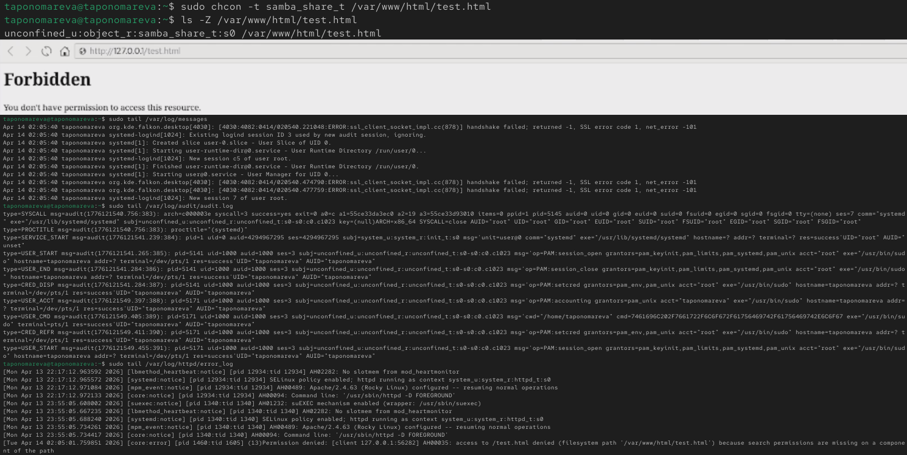{#fig-007 width=70%}

Изменяем порт на 81. В моем случае ошибки не возникает при перезагрузке, т. к. я внесла порт 81 как постоянный при помощи команды sudo firewall-cmd --permanent --add-port=81/tcp ([рис. @fig-008]).

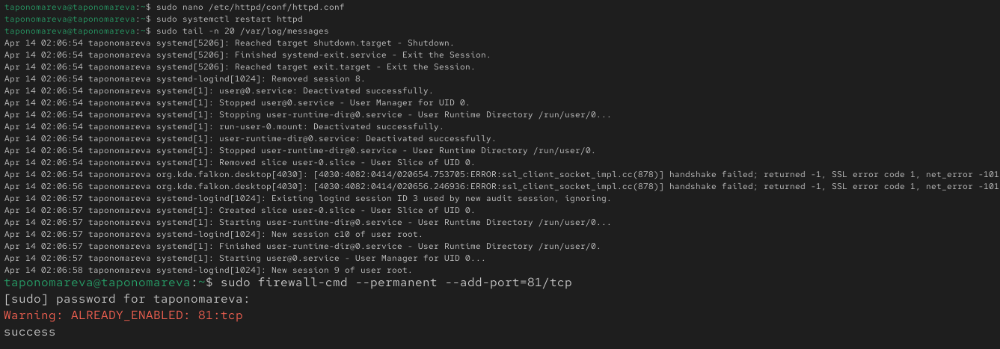{#fig-008 width=70%}

Проверяем список портов и перезапускаем ([рис. @fig-009]).

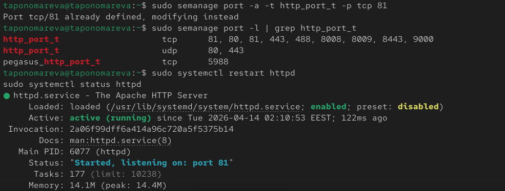{#fig-009 width=70%}

Возвращаем правильный контекст файлу и проверяем в браузере - все верно ([рис. @fig-0010]).

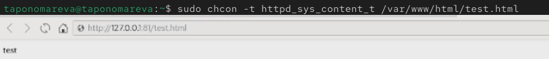{#fig-0010 width=70%}

Меняем с 81 на порт 80 в конфигурации Apache. Так как порт 81 находится в базовой политике, его не удалить. Перезапускаем Apache и удаляем /var/www/html/test.html ([рис. @fig-0011]).

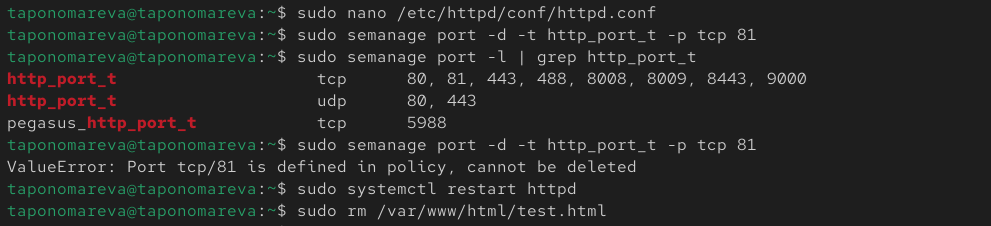{#fig-0011 width=70%}

# Выводы

В ходе выполнения лабораторной работы были развиты навыки администрирования ОС Linux, было получено первое практическое знакомство с технологией SELinux и была проверена работа SELinux на практике совместно с веб-сервером Apache.

# Список литературы{.unnumbered}

::: {#refs}
:::
