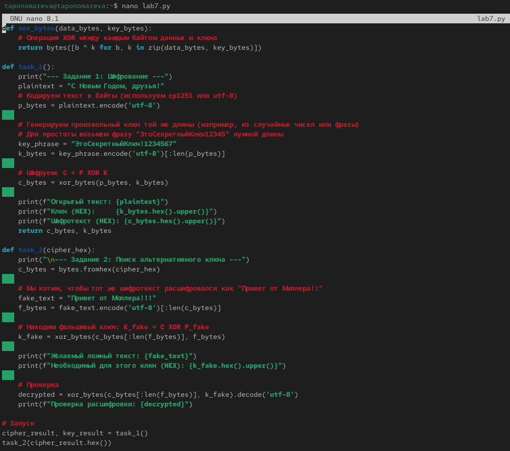
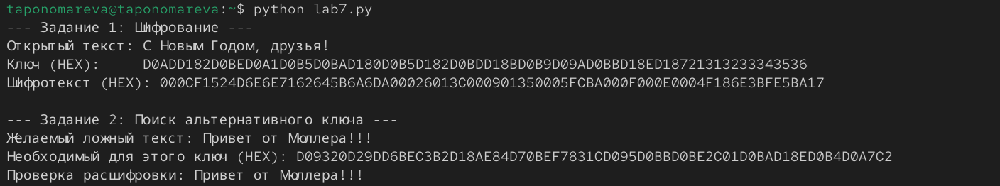

---
## Author
author:
  name: Татьяна Александровна Пономарева
  affiliation:
    - name: Российский университет дружбы народов
      country: Российская Федерация
      postal-code: 115419
      city: Москва
      address: ул. Орджоникидзе, д. 3

## Title
title: "Отчёт по лабораторной работе №7"
subtitle: "Основы информационной безопасности"
license: "CC BY"
---

# Цель работы

Освоить на практике применение режима однократного гаммирования

# Задание

Разработать приложение, позволяющее шифровать и дешифровать данные в режиме однократного кодирования

# Теоретическое введение

Гаммирование – это наложение (снятие) на открытые (зашифрованные) данные криптографической гаммы, то есть последовательности элементов данных, вырабатываемых с помощью некоторого криптографического алгоритма, для получения зашифрованных (открытых) данных.

С точки зрения теории криптоанализа, метод шифрования случайной однократной равновероятной гаммой той же длины, что и открытый текст, является невскрываемым. Кроме того, даже раскрыв часть сообщения, дешифровщик не сможет хоть сколько-нибудь поправить положение – информация о вскрытом участке гаммы не дает информации об остальных ее частях. "Наложение" гаммы не что иное, как выполнение операции сложения по модулю 2 [@studfiles_gamma].

# Выполнение лабораторной работы

Создаем файл lab7.py и пишем код на языке Python для выполнения задания ([рис. @fig-001]).

{#fig-001 width=70%}

Запускаем файл lab7.py ([рис. @fig-002]).

{#fig-002 width=70%}

# Ответы на контрольные вопросы

1. Гаммирование - это метод шифрования, при котором на открытые данные накладывается (путем операции XOR) последовательность случайных элементов (гамма). Если гамма используется только один раз, имеет длину сообщения и является абсолютно случайной, такой шифр невозможно взломать.

2. Недостатки однократного гаммирования.
*   Длина ключа должна быть равна длине самого сообщения.
*   Сложность безопасной передачи длинных ключей от отправителя к получателю.
*   Трудность генерации по-настоящему случайных (не псевдослучайных) чисел для ключа.
*   Критическое требование: один ключ — одно сообщение. Повторное использование ключа делает систему уязвимой.

3. Преимущества однократного гаммирования.
*   **Абсолютная стойкость:** доказано К. Шенноном, что при соблюдении правил шифр нельзя вскрыть даже при бесконечных вычислительных мощностях.
*   **Высокая скорость:** операция XOR выполняется процессором мгновенно.
*   **Простота реализации:** алгоритм шифрования и дешифрования идентичен.

4. Если ключ короче текста, его приходится использовать повторно (циклически). Это вносит в шифротекст периодичность, которая позволяет методами статистического анализа вычислить ключ и восстановить исходный текст.

5. В режиме однократного гаммирования используется операция **исключающего ИЛИ** (сложение по модулю 2, **XOR**, $\oplus$).
*Особенности:*
*   Обратимость: $(A \oplus B) \oplus B = A$.
*   Результат равен 0, если операнды одинаковы ($1 \oplus 1 = 0$), и 1, если они разные ($1 \oplus 0 = 1$).
*   Равновероятное распределение: если ключ случаен, то результат XOR также будет абсолютно случайным.

6. Шифротекст $C$ получается посимвольным сложением открытого текста $P$ и ключа $K$ по модулю 2:
$$C_i = P_i \oplus K_i$$

7. Поскольку операция XOR обратима, ключ $K$ можно получить, применив XOR к шифротексту $C$ и открытому тексту $P$:
$$K_i = C_i \oplus P_i$$

8. Согласно К. Шеннону, необходимы три условия:
* **Полная случайность ключа** (равномерное распределение).
*  **Равенство длин** ключа и открытого текста.
*  **Однократность использования** ключа (после сеанса связи ключ уничтожается).

# Выводы

В ходе выполнения лабораторной работы применение режима однократного гаммирования было освоено на практике 

# Список литературы{.unnumbered}

::: {#refs}
:::
