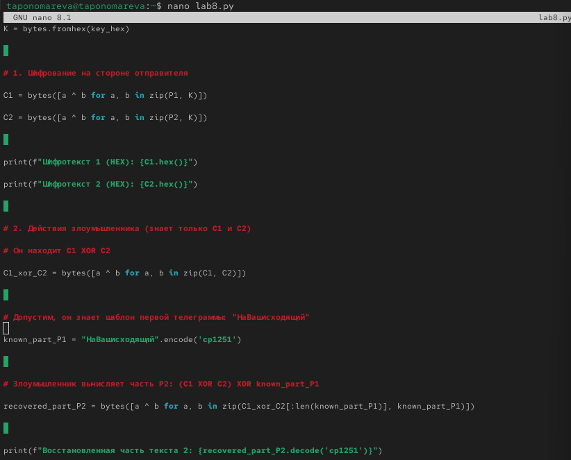

---
## Author
author:
  name: Татьяна Александровна Пономарева
  affiliation:
    - name: Российский университет дружбы народов
      country: Российская Федерация
      postal-code: 115419
      city: Москва
      address: ул. Орджоникидзе, д. 3

## Title
title: "Отчёт по лабораторной работе №8"
subtitle: "Основы информационной безопасности"
license: "CC BY"
---

# Цель работы

Освоить на практике применение режима однократного гаммирования на примере кодирования различных исходных текстов одним ключом.

# Задание

Разработать приложение, позволяющее шифровать и дешифровать тексты P1 и P2 в режиме однократного гаммирования. Приложение должно уметь определять вид шифротекстов C1 и C2 обоих текстов P1 и P2 при известном ключе. Необходимо определить и выразить аналитический способ, при котором злоумышленник может прочитать оба текста, не зная ключа и не стремясь его определить.

# Теоретическое введение

Гаммирование – это наложение (снятие) на открытые (зашифрованные) данные криптографической гаммы, то есть последовательности элементов данных, вырабатываемых с помощью некоторого криптографического алгоритма, для получения зашифрованных (открытых) данных.

С точки зрения теории криптоанализа, метод шифрования случайной однократной равновероятной гаммой той же длины, что и открытый текст, является невскрываемым. Кроме того, даже раскрыв часть сообщения, дешифровщик не сможет хоть сколько-нибудь поправить положение – информация о вскрытом участке гаммы не дает информации об остальных ее частях. "Наложение" гаммы не что иное, как выполнение операции сложения по модулю 2 [@studfiles_gamma].

# Выполнение лабораторной работы

Сначала создаем файл с кодом lab08.py ([рис. @fig-001]).

{#fig-001 width=70%}

Получаем содержание второго кода, зная содержание первого ([рис. @fig-002]).

{#fig-002 width=70%}

# Ответы на контрольные вопросы

**1. Как, зная один из текстов (\(P_1\) или \(P_2\)), определить другой, не зная при этом ключа?**  
Если известен один открытый текст, например \(P_1\), и соответствующие шифртексты \(C_1\) и \(C_2\) (полученные с одним и тем же ключом \(K\)), то можно восстановить ключ как \(K = C_1 \oplus P_1\). Затем, используя этот ключ, расшифровать второй шифртекст: \(P_2 = C_2 \oplus K = C_2 \oplus C_1 \oplus P_1\). Таким образом, знание одного текста позволяет вычислить другой без прямого знания ключа.

**2. Что будет при повторном использовании ключа при шифровании текста?**  
Повторное использование одного и того же ключа (или гаммы) для двух разных открытых текстов нарушает стойкость шифра. Противник может вычислить \(C_1 \oplus C_2 = P_1 \oplus P_2\), что даёт информацию о взаимосвязи текстов. Если один из текстов известен (или частично угадан), второй полностью раскрывается. Кроме того, возможен статистический анализ и восстановление обоих текстов. Такой режим лишает шифр свойства совершенной секретности, присущего однократной гамме.

**3. Как реализуется режим шифрования однократного гаммирования одним ключом двух открытых текстов?**  
Для реализации генерируется случайный ключ (гамма) \(K\) длиной, равной длине открытых текстов. Затем вычисляются два шифртекста:  
\(C_1 = P_1 \oplus K\),  
\(C_2 = P_2 \oplus K\).  
Один и тот же ключ \(K\) используется для обоих сообщений. Этот режим называют «двукратной гаммой» или «двухразовым блокнотом» (two-time pad).

**4. Перечислите недостатки шифрования одним ключом двух открытых текстов.**  
- Потеря свойства совершенной секретности (однократная гамма требует одноразового использования ключа).  
- При известном одном открытом тексте второй полностью раскрывается.  
- Вычисление \(C_1 \oplus C_2 = P_1 \oplus P_2\) даёт злоумышленнику возможность статистического анализа, частотного декодирования и восстановления текстов даже без знания исходных данных.  
- Уязвимость к атакам на основе известного или подобранного открытого текста.  
- Неприменимость для систем, требующих гарантированной стойкости.

**5. Перечислите преимущества шифрования одним ключом двух открытых текстов.**  
- Экономия ключевого материала – требуется сгенерировать и распределить только один ключ для двух сообщений.  
- Снижение вычислительной нагрузки (один процесс генерации гаммы вместо двух).  
- В некоторых узкоспециализированных сценариях (например, при крайнем дефиците случайных последовательностей или для маскировки факта передачи двух сообщений) может быть полезно, но с пониманием потери стойкости.  
- Простота реализации в системах, где допустимы указанные выше недостатки.

# Выводы

В ходе проведения лабораторной работы было освоено на практике применение режима однократного гаммирования на примере кодирования различных исходных текстов одним ключом.

# Список литературы{.unnumbered}

::: {#refs}
:::
