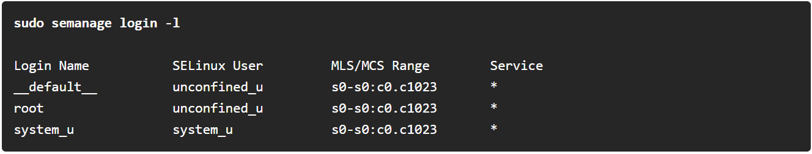

---
## Author
author:
  name: Татьяна Александровна Пономарева
  affiliation:
    - name: Российский университет дружбы народов
      country: Российская Федерация
      postal-code: 115419
      city: Москва
      address: ул. Орджоникидзе, д. 3
## Title
title: Презентация на тему SELinux
subtitle: Основы информационной безопасности
license: CC BY
date: today
date-format: "YYYY-MM-DD" # Example: 2025-09-06
---

# Информация

## Докладчик

:::::::::::::: {.columns align=center}
::: {.column width="55%"}

  *Пономарева Татьяна Александровна
  *Студент группы НКАбд-04-24
  *Российский университет дружбы народов им. П. Лумумбы
  *[taponomareva6742@gmail.com](mailto:taponomareva6742@gmail.com)
  *<https://github.com/taponomareva>

:::
::: {.column width="30%"}

:::
::::::::::::::
# Вводная часть

## Актуальность

Предотвращение потери данных из-за злоумышленников. Правильное распределение информацией

## Цель работы

Получить знания по технологии SELinux.

## Задание

Дать определение SELinux, понять для чего он используется, разобрать режимы работы SELinux и контексты безопасности.

## Теоретическое введение

SELinux обеспечивает усиление защиты путем внесения изменений как на уровне ядра, так и на уровне пространства пользователя.

# Основная часть

## Определение

SELinux (Security Enhanced Linux) - это система обязательного контроля доступа (Mandatory Access Control, MAC), построенная на модулях безопасности Linux (Linux Security Modules). На практике ядро запрашивает SELinux перед каждой системой, чтобы узнать, уполномочен ли этот процесс делать данную операцию [1]. 

Стандартная политика доступа, основанная на разрешениях пользователя, группы и других правах, известная как разграничительный контроль доступа (Discretionary Access Control, DAC), не позволяет системным администраторам создавать комплексные и детальные политики безопасности [2].

## Режимы работы

SELinux работает в одном из трёх режимов:Enforcing, Permissive, Disabled.

## Контексты безопасности

Каждый процесс и системный ресурс имеют специальную метку безопасности, известную как контекст SELinux.

Политика SELinux использует эти контексты в серии правил, которые определяют, как процессы могут взаимодействовать друг с другом и различными системными ресурсами. 

Контексты SELinux имеют несколько полей: пользователь, роль, тип, уровень безопасности.

## Идентификатор пользователя SELinux

Идентификатор пользователя SELinux — это идентификатор, известный политике, который авторизован для выполнения определенного набора ролей и для доступа к заданному диапазону уровней безопасности.

Для просмотра списка сопоставлений между учетными записями пользователей SELinux и Linux выполняется следующая команда от имени суперпользователя ([рис. @fig-001]).

{#fig-001 width=70%}

## Роль

Модель безопасности SELinux включает механизм управления доступом на основе ролей (Role-Based Access Control, RBAC). Роль является атрибутом RBAC. Пользователи SELinux авторизуются для ролей, а роли авторизуются для доменов. Роль выступает посредником между пользователями SELinux и доменами, определяя, в какие домены можно перейти.

## Тип

Тип является атрибутом принудительного контроля типов (Type Enforcement). Тип определяет домен для процессов и тип для файлов. Политика SELinux содержит правила, регулирующие взаимодействие между типами.

Информация о типах SELinux играет ключевую роль, когда речь идет о политике SELinux, поскольку наиболее распространенное правило политики, которое определяет допустимые взаимодействия между процессми и системными ресурсами, использует типы SELinux, а не полный контекст SELinux.

## Уровень

Уровень является атрибутом моделей обязательного контроля доступа — MLS и MCS. Диапазон уровня в MLS — это пара значений lowlevel-highlevel (от и до, если уровни различны) или lowlevel (если они одинаковы, например, s0 эквивалентно s0-s0). Каждый уровень — это пара "чувствительность-категория". Уровень может выглядеть так: если есть категории, уровень записывается как "чувствительность: категория-набор"; если категорий нет, он записывается как "чувствительность". Если набор категорий непрерывен, его можно сократить. Например, c0.c3 то же самое, что и c0,c1,c2,c3.

# Выводы

В итоге, были разобраны основные понятия SELinux, основные режимы работы и контексты безопасности.

# Список литературы{.unnumbered}

1. Херцог Р., Ма Р. Введение в SELinux: Debian Bookworm: от первого знакомства к мастерству [Электронный ресурс]. Справочник администратора Debian. URL: https://hertzog.pages.debian.net/debian-handbook/ru-RU/sect.selinux.html (дата обращения: 17.04.2026).
2. РЕД СОФТ. SELinux — система принудительного контроля доступа в РЕД ОС 8.0: Безопасность и управление доступом [Электронный ресурс]. База знаний РЕД ОС. URL: https://redos.red-soft.ru/base/redos-8_0/8_0-security/8_0-selinux/8_0-selinux_doc/ (дата обращения: 17.04.2026).

