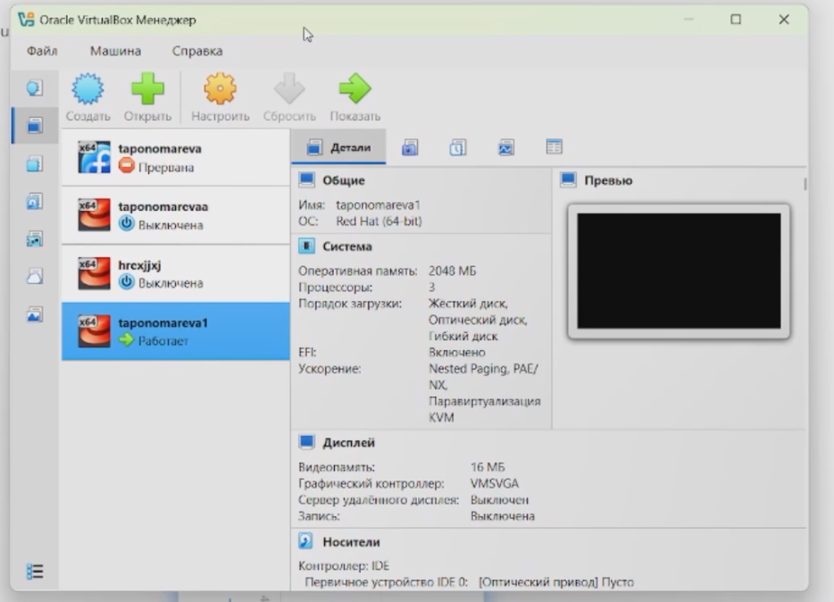
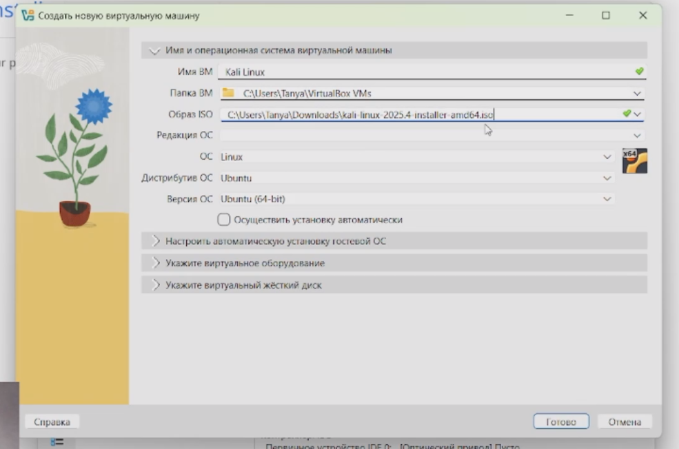
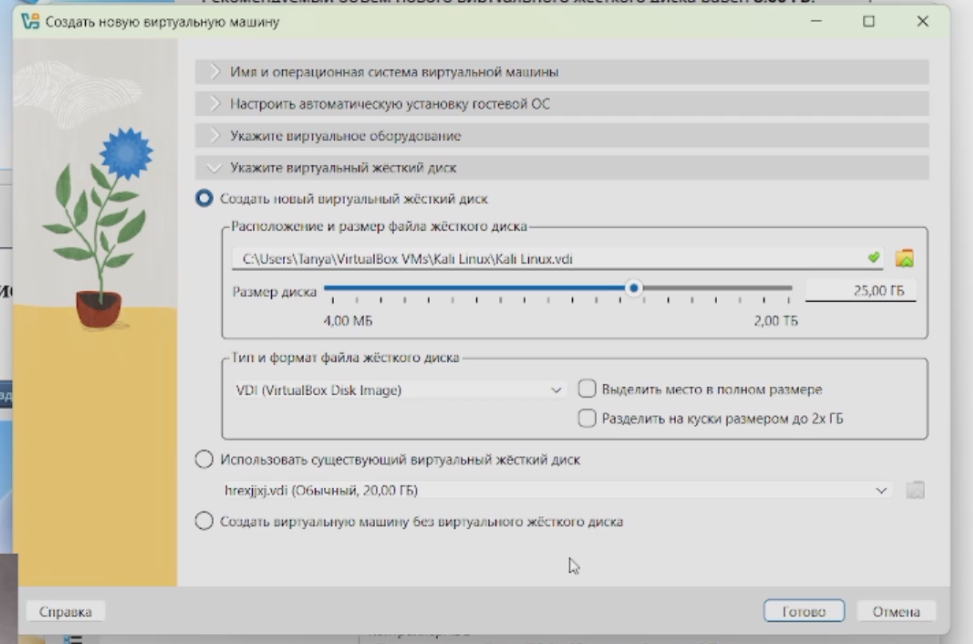
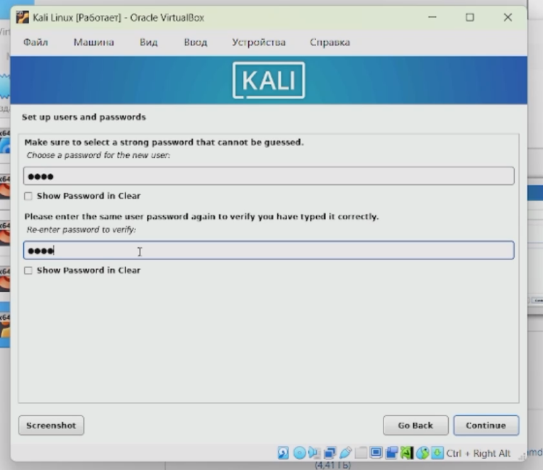
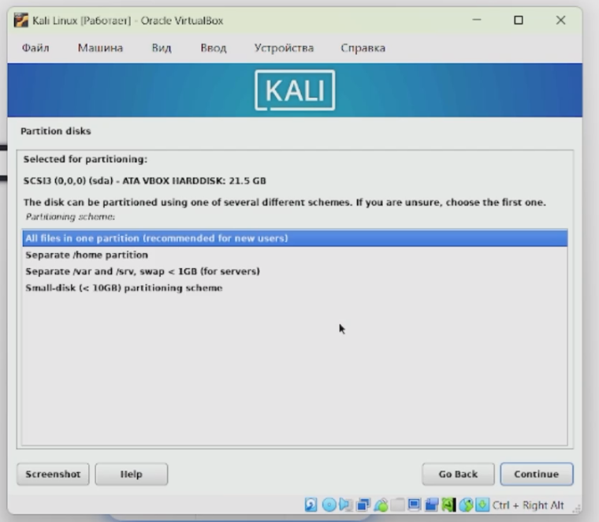
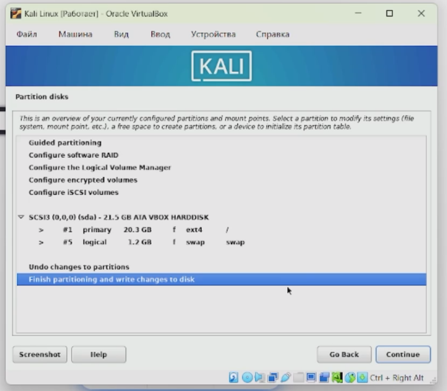
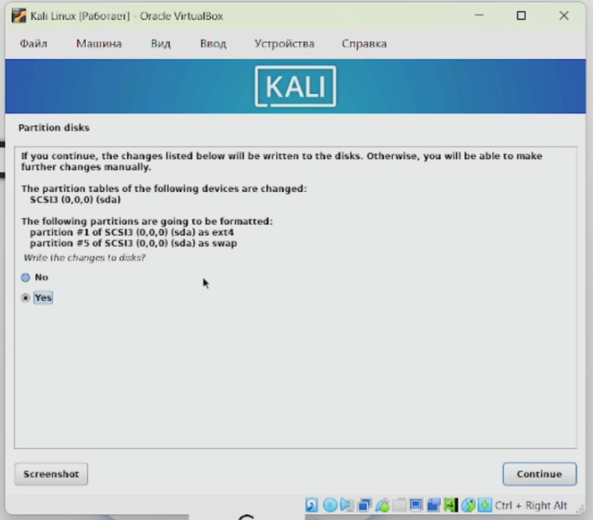
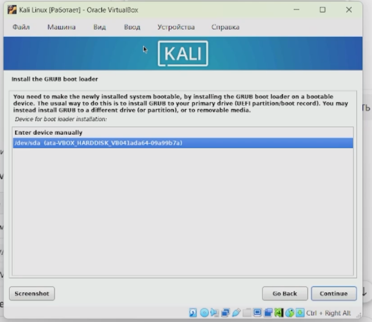

---
## Author
author:
  name: Татьяна Александровна Пономарева
  affiliation:
    - name: Российский университет дружбы народов
      country: Российская Федерация
      postal-code: 115419
      city: Москва
      address: ул. Орджоникидзе, д. 3
## Title
title: Презентация по Этапу №1 индивидуального проекта
subtitle: Основы информационной безопасности
license: CC BY
date: today
date-format: "YYYY-MM-DD" # Example: 2025-09-06
---

# Информация

## Докладчик

:::::::::::::: {.columns align=center}
::: {.column width="55%"}

  * Пономарева Татьяна Александровна
  * Студент группы НКАбд-04-24
  * Российский университет дружбы народов им. П. Лумумбы
  * [taponomareva6742@gmail.com](mailto:taponomareva6742@gmail.com)
  * <https://github.com/taponomareva>

:::
::: {.column width="30%"}

:::
::::::::::::::

# Вводная часть

## Цель работы

Целью данной работы является приобретение практических навыков установки операционной системы на виртуальную машину, настройки минимально необходимых для дальнейшей работы сервисов.

## Задание

Установить  дистрибутив Kali Linux и установить соответствующие параметры для виртуальной машины.

# Теоретическое введение

Kali Linux - это дистрибутив Linux, предназначенный для тестирования на проникновение (пентестинга) и других задач информационной безопасности. Он содержит широкий набор инструментов и функций, позволяющих специалистам по кибербезопасности выявлять и устранять уязвимости в системах и сетях [1].

Название «Kali Linux» вдохновлено именем индуистской богини Кали, а на логотипе изображён дракон. Эти символы отражают силу, мудрость и изменения, а также подчёркивают миссию дистрибутива — предоставление мощных инструментов для улучшения безопасности информационных систем [2].

# Выполнение работы

## Образ Kali Linux

Сначала скачиваем образ Kali Linux (рис. 1).

{#fig-001 width=55%}

## Открытая программа Virtual Box

Потом открываем Virtual Box (рис. 2).

{#fig-002 width=55%}

## Создание новой виртуальной машины

Создаем новую виртуальную машину на образе Kali Linux (рис. 3).

{#fig-003 width=55%}

## Настройка параметров виртуального оборудования

Указываем виртуальное оборудование (рис. 4).

{#fig-004 width=55%}

## Задание размера жесткого  диска

Задаем размер жесткого  диска (рис. 5).

{#fig-005 width=55%}

## Окно виртуальной машины

Запускаем виртуальную машину, которая была установлена на образе Kali Linux (рис. 6).

{#fig-006 width=45%}

## Настройка языка системы

Выбираем язык установки, на котором будет машина (рис. 7).

{#fig-007 width=45%}

## Задание имени хоста

Потом задаем имя хоста, в моем случае - это taponomareva (рис. 8).

{#fig-008 width=45%}

## Задание имени домена

Далее задаем имя домена (рис. 9).

{#fig-009 width=45%}

## Задание имени учетной записи

Затем задаем имя учетной записи системы (рис. 10).

{#fig-0010 width=45%}

## Задание имени пользователя

Потом задаем имя пользователя (рис. 11).

{#fig-0011 width=45%}

## Пароль

Настраиваем пароль (рис. 12).

{#fig-0012 width=45%}

## Место на жестком диске

Разделяем место на жестком диске опциями (рис. 13).

{#fig-0013 width=45%}

## Настройка распределения места на жестком диске часть 1

Был выбран диск, заданный при создании машины (рис. 14).

{#fig-0014 width=45%}

## Настройка распределения места на жестком диске часть 2

Продолжаем настройку разделения места на жестком диске (рис. 15).

{#fig-0015 width=45%}

## Настройка распределения места на жестком диске часть 3

Видим, что система показывает, как она будет разделять виртуальную память (рис. 16).

{#fig-0016 width=45%}

## Изменения в форматировании

Вносим изменения в форматировании (рис. 17).

{#fig-0017 width=45%}

## Установка дополнительных сред

Устанавливаем рекомендованные программы и средства (рис. 18).

{#fig-0018 width=45%}

## Установка загрузчика системы

Устанавливаем загрузчик системы (рис. 19).

{#fig-0019 width=45%}

## Перезагрузка

Перезагружаем машину (рис. 20).

{#fig-0020 width=45%}

## Вход в систему

При повторном запуске вводим имя пользователя и пароль (рис. 21).

{#fig-0021 width=55%}

## Рабочий стол Kali Linux

Далее видим рабочий стол Kali Linux, что показывает правильность установки (рис. 22).

{#fig-0022 width=55%}

# Выводы

При ходе работы были приобретены практические навыки установки операционной системы на виртуальную машину, настройки минимально необходимых для дальнейшей работы сервисов.

# Список литературы

1. Kali Linux: полное руководство для начинающих [Электронный ресурс]. Fox-
mindED. URL: https://foxminded.ua/ru/kali-linuks/ (дата обращения: 07.03.2025).
2. Kali Linux: обзор дистрибутива для будущих хакеров [Электронный ресурс].
Skillbox. URL: https://skillbox.ru/media/code/kali-linux-obzor-distributiva-dlya-
budushchikh-khakerov/ (дата обращения: 07.03.2025).

