---
## Author
author:
  name: Татьяна Александровна Пономарева
  affiliation:
    - name: Российский университет дружбы народов
      country: Российская Федерация
      postal-code: 115419
      city: Москва
      address: ул. Орджоникидзе, д. 3

## Title
title: "Отчёт по Этапу №1 индивидуального проекта"
bibliography: bib/cite.bib
subtitle: "Основы информационной безопасности"
---

# Цель работы

Целью данной работы является приобретение практических навыков установки операционной системы на виртуальную машину, настройки минимально необходимых для дальнейшей работы сервисов.

# Задание

Установить  дистрибутив Kali Linux и установить соответствующие параметры для виртуальной машины.

# Теоретическое введение

Kali Linux - это дистрибутив Linux, предназначенный для тестирования на проникновение (пентестинга) и других задач информационной безопасности. Он содержит широкий набор инструментов и функций, позволяющих специалистам по кибербезопасности выявлять и устранять уязвимости в системах и сетях [@foxminded_kali].

Название «Kali Linux» вдохновлено именем индуистской богини Кали, а на логотипе изображён дракон. Эти символы отражают силу, мудрость и изменения, а также подчёркивают миссию дистрибутива — предоставление мощных инструментов для улучшения безопасности информационных систем [@skillbox_kali].

# Выполнение работы

Сначала скачиваем образ Kali Linux ([рис. @fig-001]).

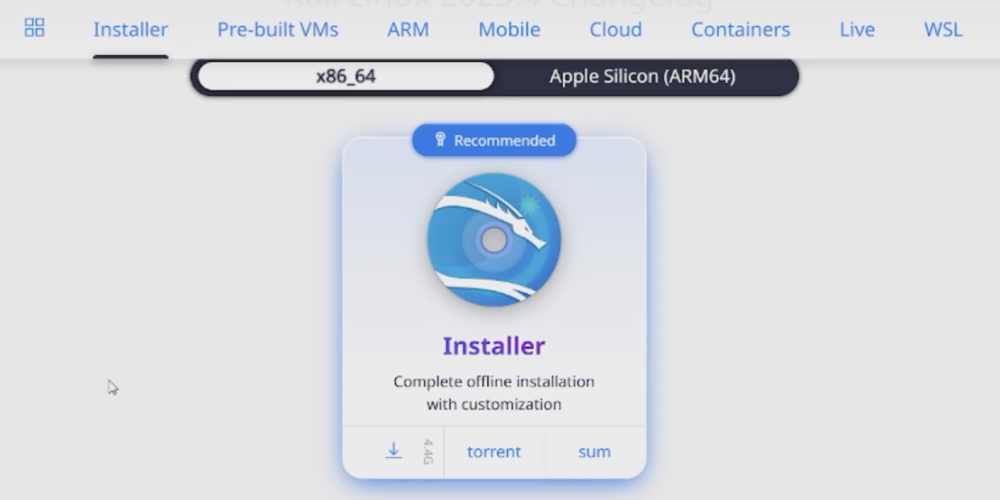{#fig-001 width=65%}

Потом открываем Virtual Box ([рис. @fig-002]).

{#fig-002 width=65%}

Создаем новую виртуальную машину на образе Kali Linux ([рис. @fig-003]).

{#fig-003 width=65%}

Указываем виртуальное оборудование ([рис. @fig-004]).

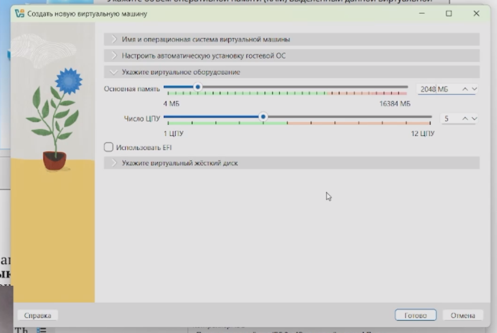{#fig-004 width=65%}

Задаем размер жесткого  диска ([рис. @fig-005]).

{#fig-005 width=65%}

Запускаем виртуальную машину, которая была установлена на образе Kali Linux ([рис. @fig-006]).

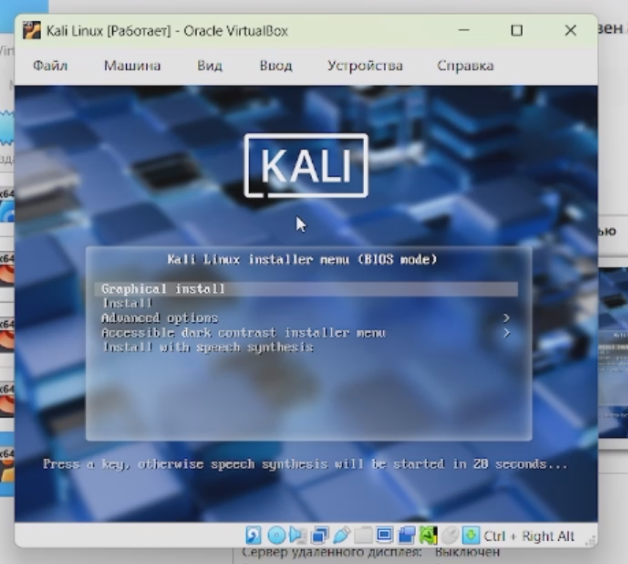{#fig-006 width=65%}

Выбираем устаивавший язык, на котором будет машина ([рис. @fig-007]).

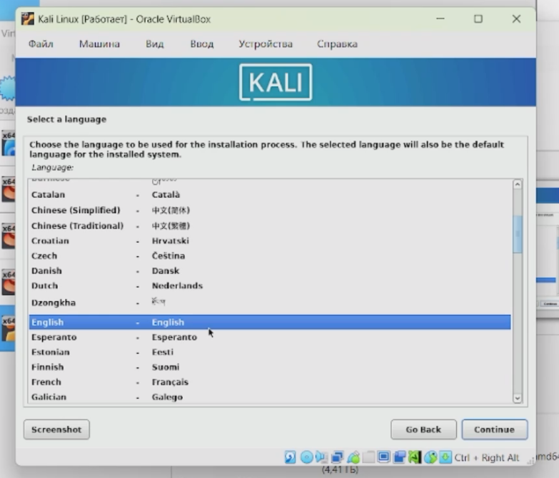{#fig-007 width=65%}

Потом задаем имя поста, в моем случае - это taponomareva ([рис. @fig-008]).

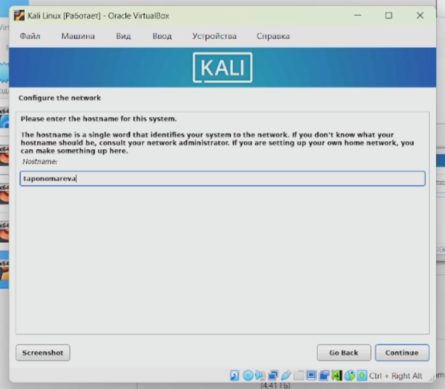{#fig-008 width=65%}

Далее задаем имя домена ([рис. @fig-009]).

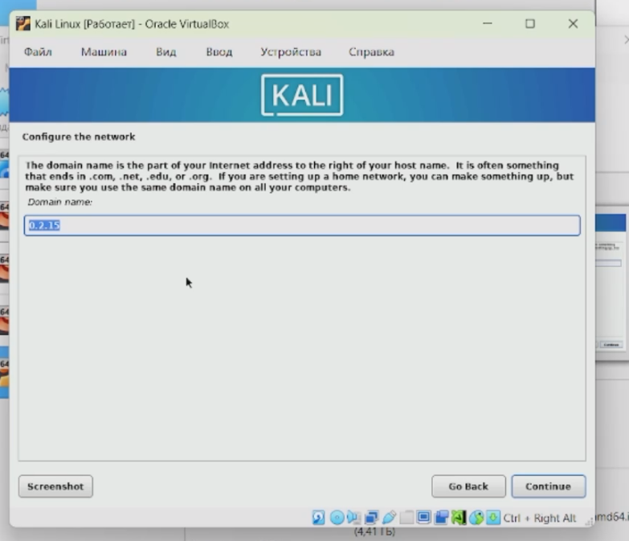{#fig-009 width=65%}

Затем задаем имя учетной записи системы ([рис. @fig-0010]).

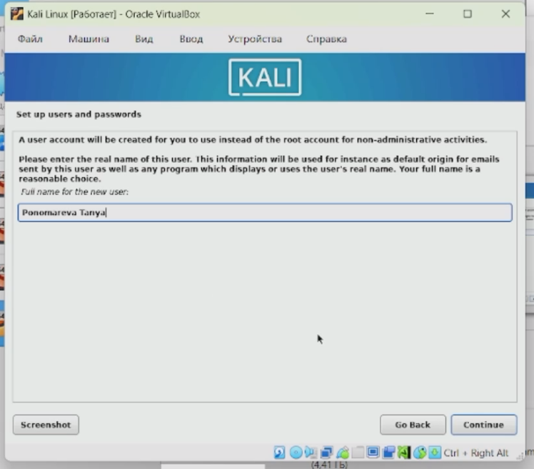{#fig-0010 width=65%}

Потом задаем имя пользователя ([рис. @fig-0011]).

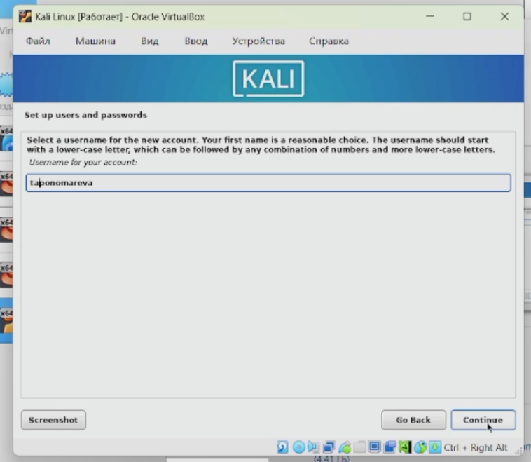{#fig-0011 width=65%}

Настраиваем пароль ([рис. @fig-0012]).

{#fig-0012 width=65%}

Разделяем место на жестком диске опциями ([рис. @fig-0013]).

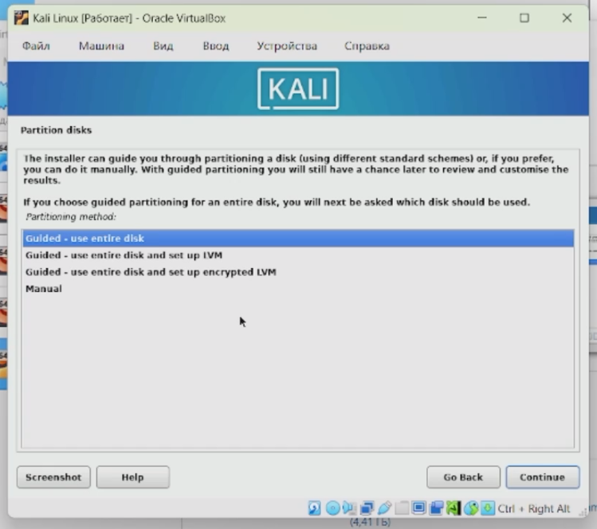{#fig-0013 width=65%}

Был выбран диск, заданный при создании машины ([рис. @fig-0014]).

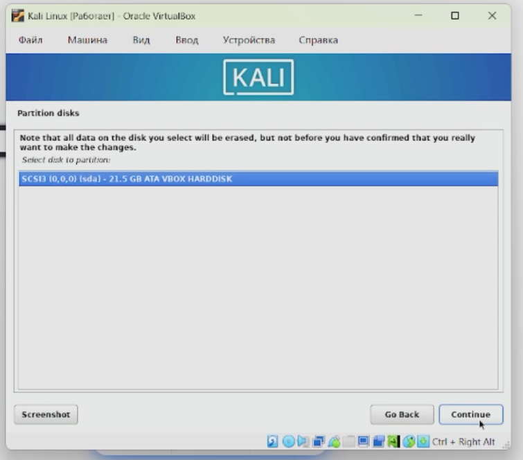{#fig-0014 width=65%}

Продолжаем настройку разделения места на жестком диске ([рис. @fig-0015]).

{#fig-0015 width=65%}

Видим, что система показывает, как она будет разделять виртуальную память ([рис. @fig-0016]).

{#fig-0016 width=65%}

Вносим изменения в форматировании ([рис. @fig-0017]).

{#fig-0017 width=65%}

Устанавливаем рекомендованные программы и средства ([рис. @fig-0018]).

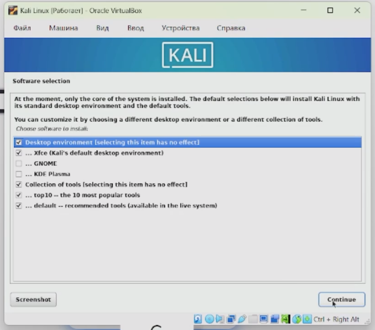{#fig-0018 width=65%}

Устанавливаем загрузчик системы ([рис. @fig-0019]).

{#fig-0019 width=65%}

Перезагружаем машину ([рис. @fig-0020]).

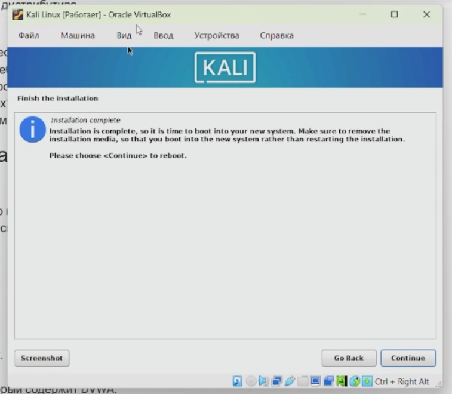{#fig-0020 width=65%}

При повторном запуске вводим имя пользователя и пароль ([рис. @fig-0021]).

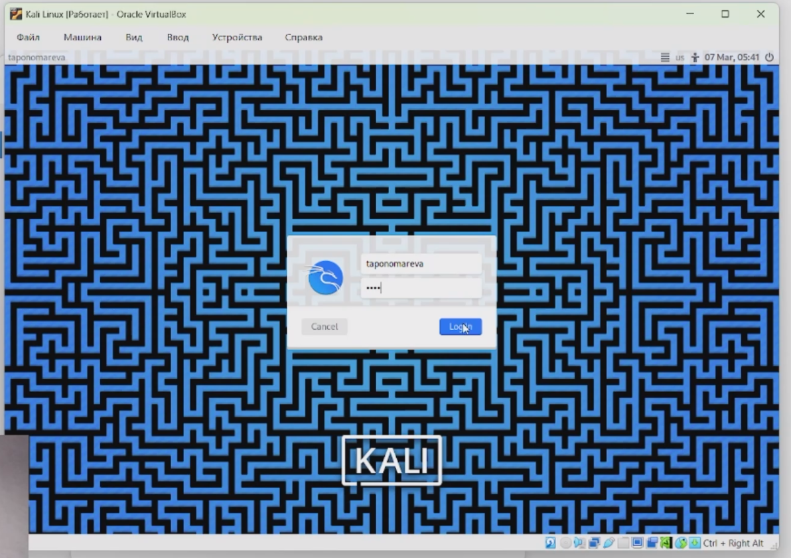{#fig-0021 width=65%}

Далее видим рабочий стол Kali Linux, что показывает правильность установки ([рис. @fig-0022]).

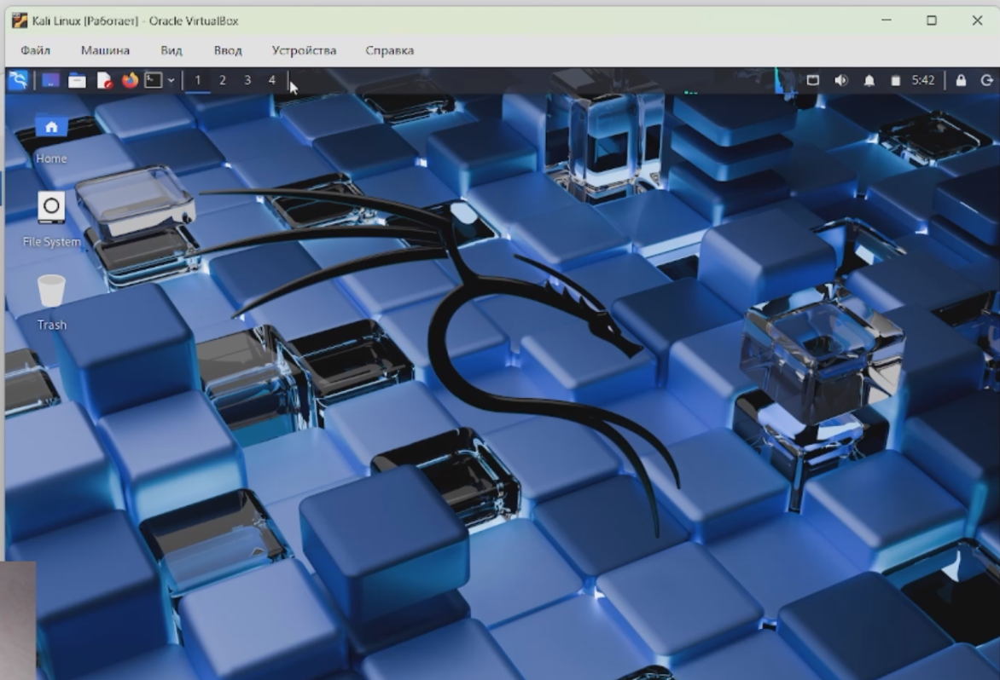{#fig-0022 width=65%}

# Выводы

При ходе работы были приобретены практические навыки установки операционной системы на виртуальную машину, настройки минимально необходимых для дальнейшей работы сервисов.

# Список литературы{.unnumbered}

::: {#refs}
:::
