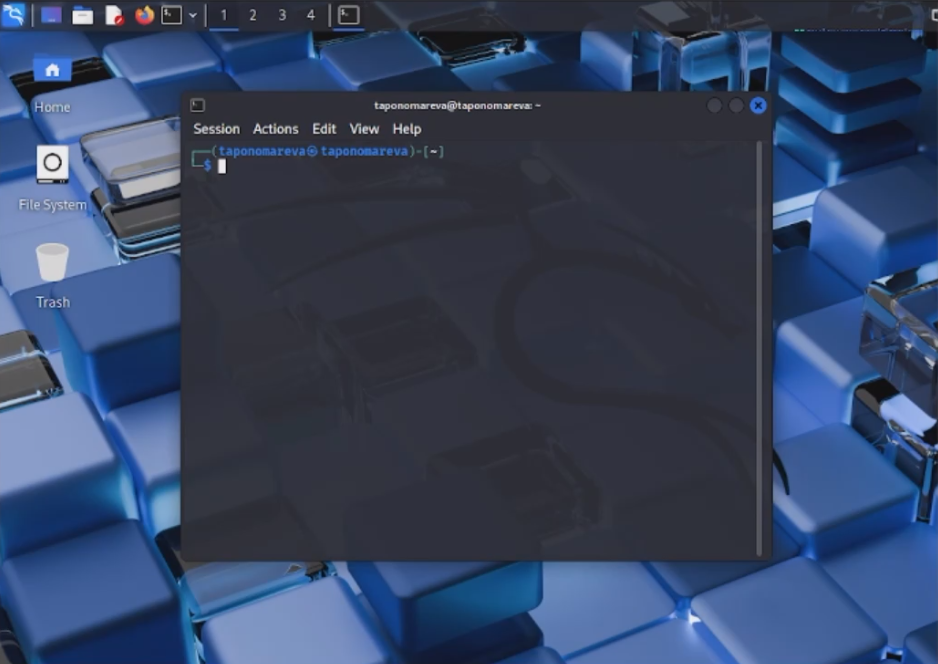
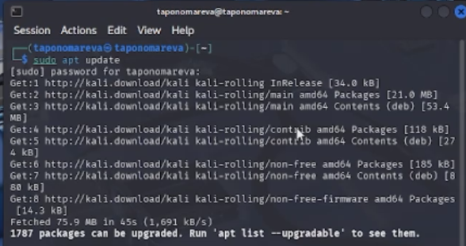
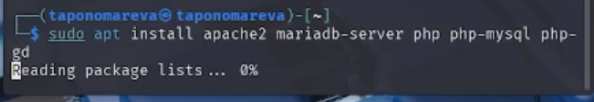
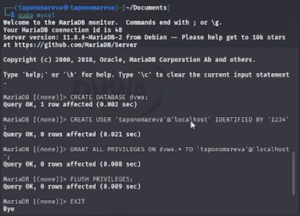
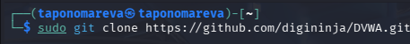
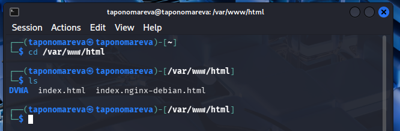
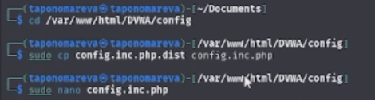
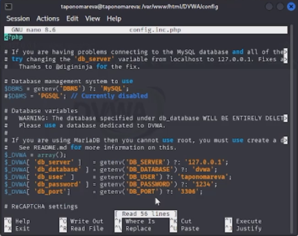
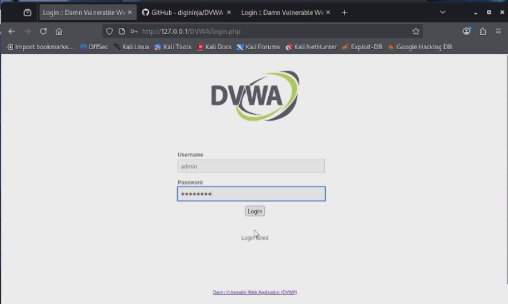
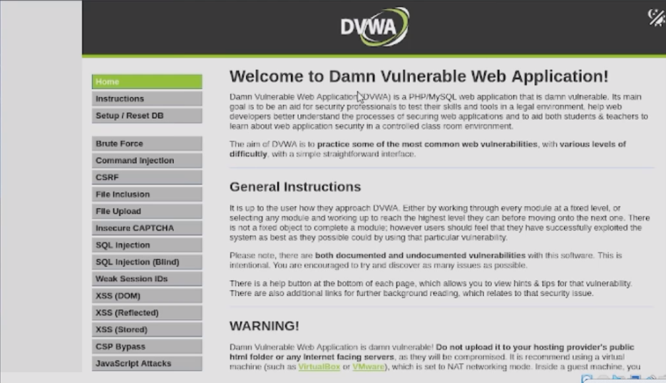

---
## Author
author:
  name: Татьяна Александровна Пономарева
  affiliation:
    - name: Российский университет дружбы народов
      country: Российская Федерация
      postal-code: 115419
      city: Москва
      address: ул. Орджоникидзе, д. 3
## Title
title: Презентация по Этапу №2 индивидуального проекта
subtitle: Основы информационной безопасности
license: CC BY
date: today
date-format: "YYYY-MM-DD" # Example: 2025-09-06
---

# Информация

## Докладчик

:::::::::::::: {.columns align=center}
::: {.column width="55%"}

  * Пономарева Татьяна Александровна
  * Студент группы НКАбд-04-24
  * Российский университет дружбы народов им. П. Лумумбы
  * [taponomareva6742@gmail.com](mailto:taponomareva6742@gmail.com)
  * <https://github.com/taponomareva>

:::
::: {.column width="30%"}

:::
::::::::::::::

# Вводная часть

## Цель работы

Целью данной работы является приобретение практических навыков установки дистрибутива в гостевую систему, необходимых для дальнейшей работы.

## Задание

Установить DVWA в гостевую систему к Kali Linux.

# Теоретическое введение

DVWA - это намеренно уязвимое веб-приложение, созданное для профессионалов в области безопасности, разработчиков, чтобы они могли использовать свои инструменты тестирования, его цель - это предоставить реалистичную среду для проверки веб-уязвимости системы [1].

# Выполнение лабораторной работы

## Рабочий стол Kali Linux

Сначала заходим в Kali Linux ([рис. @fig-001]).

{#fig-001 width=45%}

## Установка обновления

Потом устанавливаем необходимые обновления ([рис. @fig-002]).

{#fig-002 width=70%}

## Установка среды разработки

Затем устанавливаем среды разработки ([рис. @fig-003]).

{#fig-003 width=70%}

## Настройка среды базы данных

Далее через MySQL создаем базу данных dvwa, пользователя, и назначаем права доступа с применением изменений ([рис. @fig-004]).

{#fig-004 width=45%}

## Клонирование репозитория DVWA

Клонируем репозиторий через GitHub в систему ([рис. @fig-005]).

{#fig-005 width=70%}

## Расположение репозитория

Проверяем расположение репозитория, который клонировался в отдельную директорию ([рис. @fig-006]).

{#fig-006 width=70%}

## Переход в поддиректорию config для файла конфигурации

Потом переходим в /var/www/html/DVWA/config с файлом конфигурации ([рис. @fig-007]).

{#fig-007 width=70%}

## Редактирование файла конфигурации

Редактируем файл конфигурации, внося имя пользователя ([рис. @fig-008]).

{#fig-008 width=45%}

## Вход в систему

Затем переходим на сайт http://127.0.0.1/DVWA/login.php и вводим username:admin с паролем:password ([рис. @fig-009]).

{#fig-009 width=45%}

## Главная страница DVWA

Видим, что вход был успешно совершен ([рис. @fig-0010]).

{#fig-0010 width=70%}

# Выводы

При ходе работы были приобретены практические навыки установки дистрибутива в гостевую систему, необходимые для дальнейшей работы.

# Список литературы

1. Что такое DVWA? [Электронный ресурс]. Edgenexus. URL: https://www.edgenexus.io/ru/dvwa/ (дата обращения: 21.03.2025).
