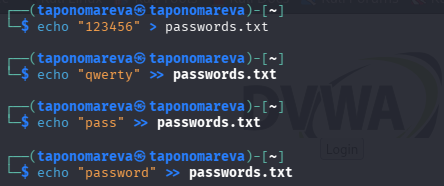
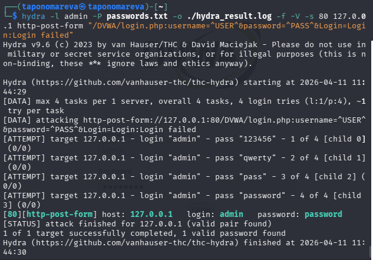

---
## Author
author:
  name: Татьяна Александровна Пономарева
  affiliation:
    - name: Российский университет дружбы народов
      country: Российская Федерация
      postal-code: 115419
      city: Москва
      address: ул. Орджоникидзе, д. 3
## Title
title: Презентация по Этапу №3 индивидуального проекта
subtitle: Основы информационной безопасности
license: CC BY
date: today
date-format: "YYYY-MM-DD" # Example: 2025-09-06
---

# Информация

## Докладчик

:::::::::::::: {.columns align=center}
::: {.column width="55%"}

  * Пономарева Татьяна Александровна
  * Студент группы НКАбд-04-24
  * Российский университет дружбы народов им. П. Лумумбы
  * [taponomareva6742@gmail.com](mailto:taponomareva6742@gmail.com)
  * <https://github.com/taponomareva>

:::
::: {.column width="30%"}

:::
::::::::::::::

# Вводная часть

## Цель работы

Целью данной работы является приобретение практических навыков освоения инструмента Hydra

## Задание

Создать файл с паролями и протестировать их на использовании Hydra

# Теоретическое введение

DVWA - это намеренно уязвимое веб-приложение, созданное для профессионалов в области безопасности, разработчиков, чтобы они могли использовать свои инструменты тестирования, его цель - это предоставить реалистичную среду для проверки веб-уязвимости системы [@dvwa_guide].

Hydra - это инструмент, используемый для подбора или взлома имени пользователя или пароля.

# Выполнение лабораторной работы

## Создание файла с паролями

Сначала создаю файл тестируемых паролей ([рис. @fig-001]).

{#fig-001 width=70%}

## Подбор паролей

Потом при помощи Hydra идет автоматический подбор паролей. Как видим, пароль "password" подошел и в конце отметился зеленым цветом ([рис. @fig-002]).

{#fig-002 width=55%}

# Выводы

При ходе работы были приобретены практические навыки освоения инструмента Hydra
