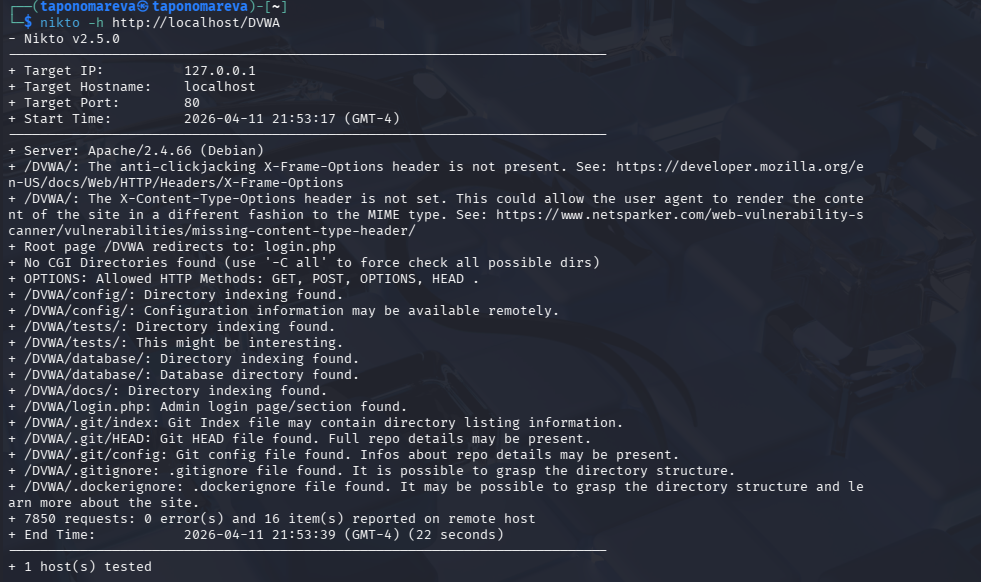

---
## Author
author:
  name: Татьяна Александровна Пономарева
  affiliation:
    - name: Российский университет дружбы народов
      country: Российская Федерация
      postal-code: 115419
      city: Москва
      address: ул. Орджоникидзе, д. 3
## Title
title: Презентация по Этапу №4 индивидуального проекта
subtitle: Основы информационной безопасности
license: CC BY
date: today
date-format: "YYYY-MM-DD" # Example: 2025-09-06
---

# Информация

## Докладчик

:::::::::::::: {.columns align=center}
::: {.column width="55%"}

  * Пономарева Татьяна Александровна
  * Студент группы НКАбд-04-24
  * Российский университет дружбы народов им. П. Лумумбы
  * [taponomareva6742@gmail.com](mailto:taponomareva6742@gmail.com)
  * <https://github.com/taponomareva>

:::
::: {.column width="30%"}

:::
::::::::::::::

# Вводная часть

## Цель работы

Целью данной работы является приобретение практических навыков освоения сканера безопасности nikto

## Задание

Провести сканирование DVWA при помощи nikto

# Теоретическое введение

DVWA - это намеренно уязвимое веб-приложение, созданное для профессионалов в области безопасности, разработчиков, чтобы они могли использовать свои инструменты тестирования, его цель - это предоставить реалистичную среду для проверки веб-уязвимости системы [1].

nikto — базовый сканер безопасности веб-сервера. Он сканирует и обнаруживает уязвимости в веб-приложениях, обычно вызванные неправильной конфигурацией на самом сервере, файлами, установленными по умолчанию, и небезопасными файлами, а также устаревшими серверными приложениями.

# Выполнение лабораторной работы

## Сканирование при помощи nikto

Запускаю сканирование при помощи nikto. Видим, что nikto вывел адрес сети, имя хоста, значение порта, сервер и проверил директории /DVWA. В конце написано, что был протестирован один хост ([рис. @fig-001]).

{#fig-001 width=55%}

# Выводы

При ходе работы были приобретены практические навыки освоения сканера безопасности nikto

# Список литературы

1. Что такое DVWA? [Электронный ресурс]. Edgenexus. URL: https://www.edgenexus.io/ru/dvwa/ (дата обращения: 12.04.2026).
