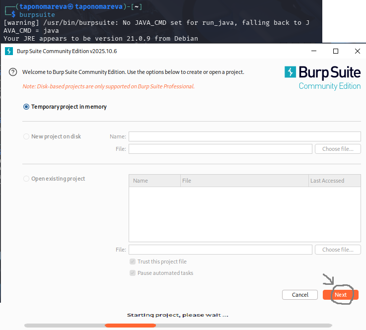
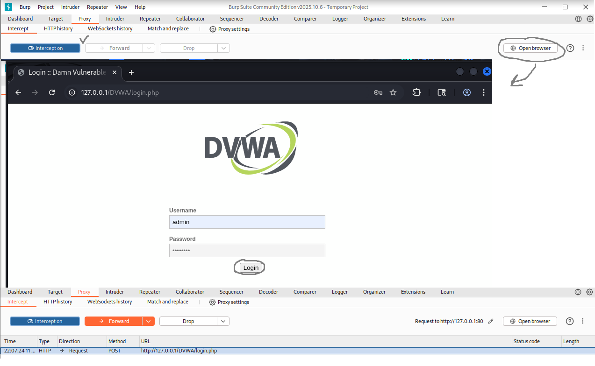
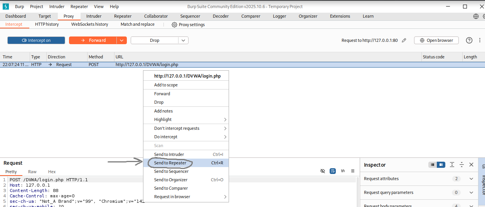
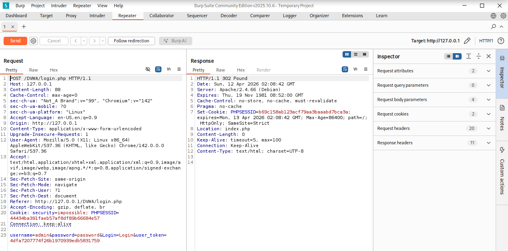

---
## Author
author:
  name: Татьяна Александровна Пономарева
  affiliation:
    - name: Российский университет дружбы народов
      country: Российская Федерация
      postal-code: 115419
      city: Москва
      address: ул. Орджоникидзе, д. 3
## Title
title: Презентация по Этапу №5 индивидуального проекта
subtitle: Основы информационной безопасности
license: CC BY
date: today
date-format: "YYYY-MM-DD" # Example: 2025-09-06
---

# Информация

## Докладчик

:::::::::::::: {.columns align=center}
::: {.column width="55%"}

  * Пономарева Татьяна Александровна
  * Студент группы НКАбд-04-24
  * Российский университет дружбы народов им. П. Лумумбы
  * [taponomareva6742@gmail.com](mailto:taponomareva6742@gmail.com)
  * <https://github.com/taponomareva>

:::
::: {.column width="30%"}

:::
::::::::::::::

# Вводная часть

## Цель работы

Целью данной работы является приобретение практических навыков освоения инструмента Burp Suite

## Задание

Провести работу с набором инструментов Burp Suite на примере сайта DVWA

# Теоретическое введение

DVWA - это намеренно уязвимое веб-приложение, созданное для профессионалов в области безопасности, разработчиков, чтобы они могли использовать свои инструменты тестирования, его цель - это предоставить реалистичную среду для проверки веб-уязвимости системы [1].

Burp Suite представляет собой набор мощных инструментов безопасности веб-приложений, которые демонстрируют реальные возможности злоумышленника, проникающего в веб-приложения.

# Выполнение лабораторной работы

## Вызов Burp Suite

Сначала ввожу команду burpsuite для вызова инструмента Burp Suite и создаю временный проект ([рис. @fig-001]).

{#fig-001 width=40%}

## Запуск перехвата и логин на сайте

Потом открываю браузер, нажав на кнопку "Open browser", ввожу логин и пароль, захожу на вкладку "Proxy" в Burp Suite и запускаю перехват кнопкой "Intercept on", затем нажимаю на "Login" на странице веб-сервера DVWA. Страница в браузере не отвечает и открывается как запрос в Burp Suite ([рис. @fig-002]).

{#fig-002 width=50%}

## Окно Burp Suite и нажатие на "Send to Repeater"

Далее нажимаю на "Send to Repeater" для детальной информации по нашему входу на сайте ([рис. @fig-003]).

{#fig-003 width=70%}

## Информация по входу на сайт DVWA

Затем перехожу во вкладку "Repeater" и нажимаю на "Send". Заметим, что можно увидеть информацию про когда и какой хост, вид безопасности и ключ ID у пользователя, с какого сервера и под каким паролем и именем пользователя был совершен вход ([рис. @fig-004]).

{#fig-004 width=70%}

# Выводы

При ходе работы были приобретены практические навыки освоения инструмента Burp Suite

# Список литературы

1. Что такое DVWA? [Электронный ресурс]. Edgenexus. URL: https://www.edgenexus.io/ru/dvwa/ (дата обращения: 12.04.2026).
