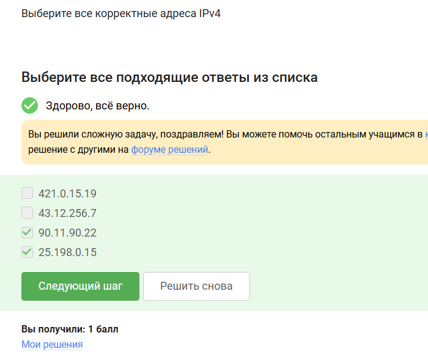
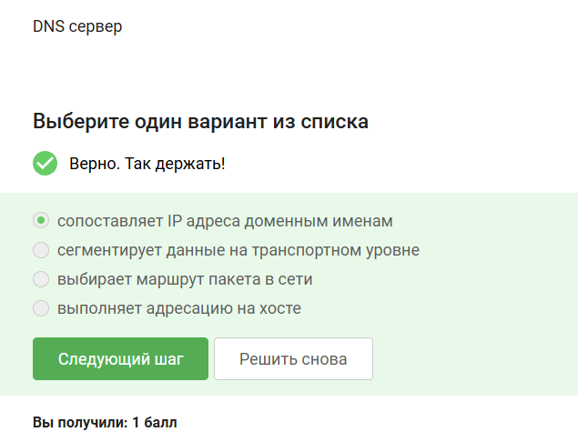
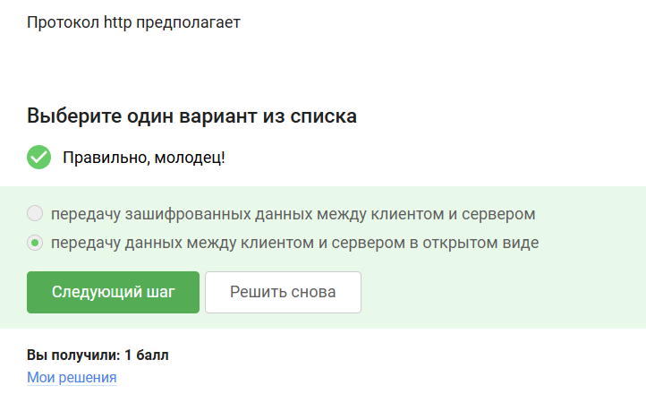
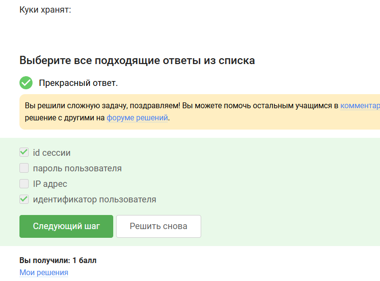
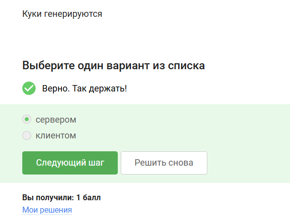
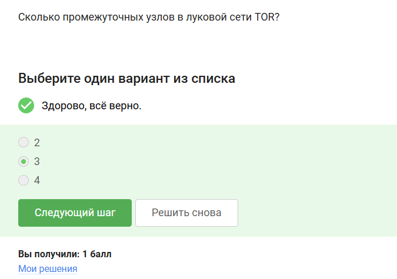
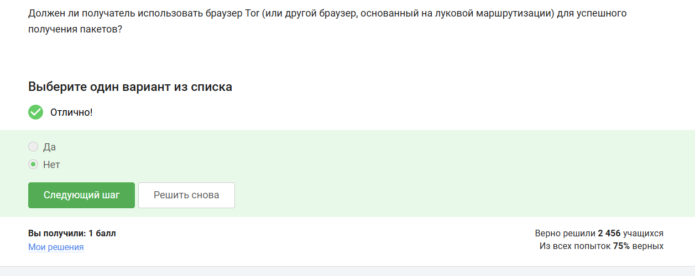
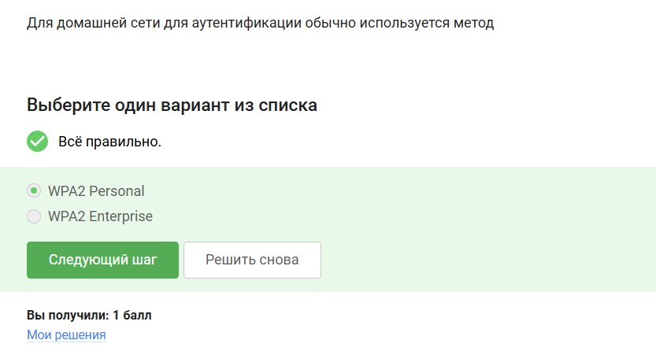

---
## Author
author:
  name: Татьяна Александровна Пономарева
  affiliation:
    - name: Российский университет дружбы народов
      country: Российская Федерация
      postal-code: 115419
      city: Москва
      address: ул. Орджоникидзе, д. 3
## Title
title: Презентация по разделу №1 Безопасность в сети внешнего курса на тему Основы кибербезопасности
subtitle: Основы информационной безопасности
license: CC BY
date: today
date-format: "YYYY-MM-DD" # Example: 2025-09-06
---

# Информация

## Докладчик

:::::::::::::: {.columns align=center}
::: {.column width="55%"}

  *Пономарева Татьяна Александровна
  *Студент группы НКАбд-04-24
  *Российский университет дружбы народов им. П. Лумумбы
  *[taponomareva6742@gmail.com](mailto:taponomareva6742@gmail.com)
  *<https://github.com/taponomareva>

:::
::: {.column width="30%"}

:::
::::::::::::::

# Вводная часть

## Цель работы

Выполнить задания раздела 1 и понять, что из себя представляет безопасность в сети.

## Теоретическое введение

Данный курс рассчитан на любого пользователя ПК/смартфона/банкомата и состоит из 3-х разделов, также он содержит лекции, материалы для доп. чтения и тесты [1].

# Выполнение заданий раздела 1 "Безопасность в сети"

## Как работает интернет: базовые сетевые протоколы. Протокол прикладного уровня

Протокол прикладного уровня - HTTPS  ([рис. @fig-001]).

{#fig-001 width=50%}

## Уровень протокола ТСР

Протокол ТСР работает на транспортном уровне ([рис. @fig-002]).

{#fig-002 width=50%}

## Корректные адреса IPv4

Корректные адреса IPv4 - это те, которые соответствуют правилам составления адреса, т е 90.11.90.22 и 25.198.0.15. Остальные не подходят, т к число, стоящее в составе адреса, не может превышать 255 ([рис. @fig-003]).

{#fig-003 width=40%}

## Функция DNS сервера

DNS сервер сопоставляет IP адреса доменным именам ([рис. @fig-004]).

{#fig-004 width=50%}

## Последовательность протоколов в модели TCP/IP

Корректная последовательность протоколов в модели TCP/IP:прикладной - транспортный - сетевой - канальный ([рис. @fig-005]).

{#fig-005 width=50%}

## Функция протокола http

Протокол http предполагает передачу данных между клиентом и сервером в открытом виде, т к в конце не стоит s ([рис. @fig-006]).

{#fig-006 width=50%}

## Состав протокола https

Протокол https состоит из двух фаз: рукопожатия и передачи данных ([рис. @fig-007]).

{#fig-007 width=50%}

## Определение версии протокола TLS

Версия протокола TLS определяется и клиентом, и сервером в процессе "переговоров" ([рис. @fig-008]).

{#fig-008 width=50%}

## Отсутствие шифрования данных в фазе "рукопожатия" протокола TLS

В фазе "рукопожатия" протокола TLS не предусмотрено шифрование данных ([рис. @fig-009]).

{#fig-009 width=50%}

## Персонализация сети. Состав куки

Куки хранят: id сессии и идентификатор пользователя ([рис. @fig-0010]).

{#fig-0010 width=50%}

## Неиспользование куки

Куки не используются для улучшения надежности соединения ([рис. @fig-0011]).

{#fig-0011 width=50%}

## Генерация куки

Куки генерируются сервером, а не клиентом ([рис. @fig-0012]).

{#fig-0012 width=50%}

## Хранение куки

Сессионные куки хранятся в браузере на время пользования сайтом ([рис. @fig-0013]).

{#fig-0013 width=50%}

## Браузер TOR. Анонимизация. Количество узлов в сети TOR

В луковой сети TOR находится 3 промежуточных узла ([рис. @fig-0014]).

{#fig-0014 width=50%}

## Доступ к IP-адресу получателя

IP-адрес получателя известен отправителю и выходному узлу ([рис. @fig-0015]).

{#fig-0015 width=45%}

## Генерация общего секретного ключа и доступ к нему

Отправитель генерирует общий секретный ключ с охранным, промежуточным и выходным узлом ([рис. @fig-0016]).

{#fig-0016 width=50%}

## Браузер TOR не является необходимым 

Пользователь не должен использовать браузер TOR для успешного получения пакетов ([рис. @fig-0017]).

{#fig-0017 width=50%}

## Беспроводные сети Wi-fi. Определение Wi-fi

Wi-fi - это технология беспроводной локальной сети, работающая в соответствии со стандартом IEEE 502.11 ([рис. @fig-0018]).

{#fig-0018 width=50%}

## Уровень работы протокола Wi-fi

Протокол Wi-fi работает на канальном уровне ([рис. @fig-0019]).

{#fig-0019 width=50%}

## Небезопасный метод обеспечения шифрования и аутентификации в сети Wi-Fi

WEP - небезопасный метод обеспечения шифрования и аутентификации в сети Wi-Fi ([рис. @fig-0020]).

{#fig-0020 width=50%}

## Передача данных между хостом сети и роутером

Данные между хостом сети (компьютером и смартфоном) и роутером передаются в зашифрованном виде после аутентификации устройства ([рис. @fig-0021]).

{#fig-0021 width=50%}

## Метод WPA2 Personal

Для домашней сети для аутентификации обычно используется метод WPA2 Personal ([рис. @fig-0022]).

{#fig-0022 width=50%}

# Выводы

В ходе прохождения раздела 1 внешнего курса были выполнены задания раздела 1 и была изучена характеристика безопасности в сети.

# Список литературы{.unnumbered}

1. И. Канта Б. им. Основы кибербезопасности: Внешний курс на платформе Stepik [Электронный ресурс]. Платформа Stepik. URL: https://stepik.org/111512 (дата обращения: 28.04.2026).

