---
## Author
author:
  name: Татьяна Александровна Пономарева
  affiliation:
    - name: Российский университет дружбы народов
      country: Российская Федерация
      postal-code: 115419
      city: Москва
      address: ул. Орджоникидзе, д. 3

## Title
title: "Отчёт по разделу №1 'Безопасность в сети' внешнего курса на тему: 'Основы кибербезопасности'"
subtitle: "Основы информационной безопасности"
license: "CC BY"
---

# Цель работы

Выполнить задания раздела 1 и понять, что из себя представляет безопасность в сети.

# Теоретическое введение

Данный курс рассчитан на любого пользователя ПК/смартфона/банкомата и состоит из 3-х разделов, также он содержит лекции, материалы для доп. чтения и тесты [@stepik_course].

# Выполнение заданий раздела 1 "Безопасность в сети"
## Как работает интернет: базовые сетевые протоколы

Протокол прикладного уровня - HTTPS  ([рис. @fig-001]).

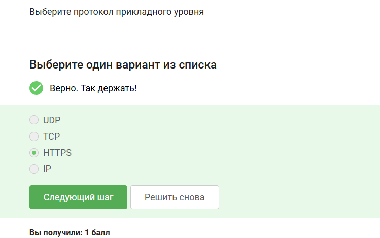{#fig-001 width=100%}

Протокол ТСР работает на транспортном уровне ([рис. @fig-002]).

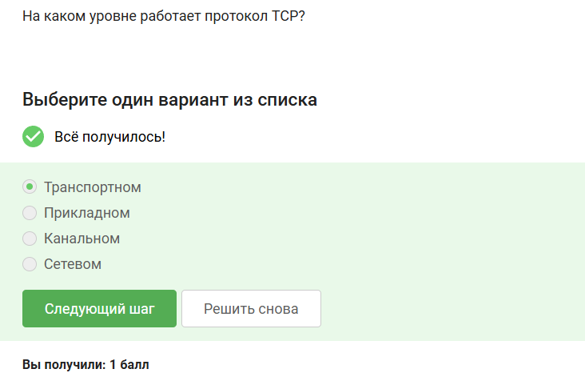{#fig-002 width=65%}

Корректные адреса IPv4 - это те, которые соответствуют правилам составления адреса, т е 90.11.90.22 и 25.198.0.15. Остальные не подходят, т к число, стоящее в составе адреса, не может превышать 255 ([рис. @fig-003]).

{#fig-003 width=75%}

DNS сервер сопоставляет IP адреса доменным именам ([рис. @fig-004]).

{#fig-004 width=75%}

Корректная последовательность протоколов в модели TCP/IP:прикладной - транспортный - сетевой - канальный ([рис. @fig-005]).

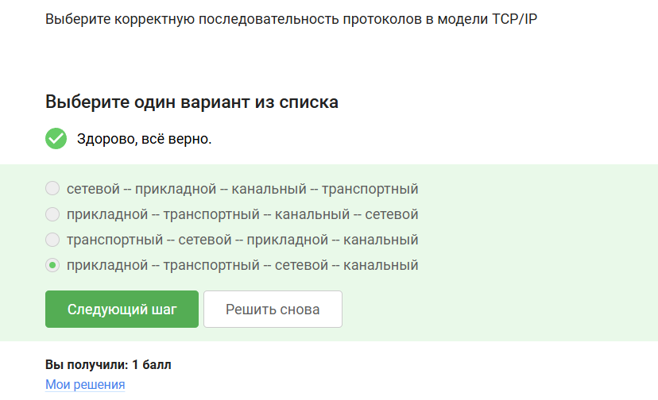{#fig-005 width=85%}

Протокол http предлагает передачу данных между клиентом и сервером в открытом виде, т к в конце не стоит s ([рис. @fig-006]).

{#fig-006 width=95%}

Протокол https состоит из двух фаз: рукопожатия и передачи данных ([рис. @fig-007]).

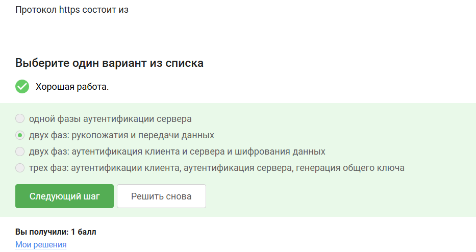{#fig-007 width=95%}

Версия протокола TLS определяется и клиентом, и сервером в процессе "переговоров" ([рис. @fig-008]).

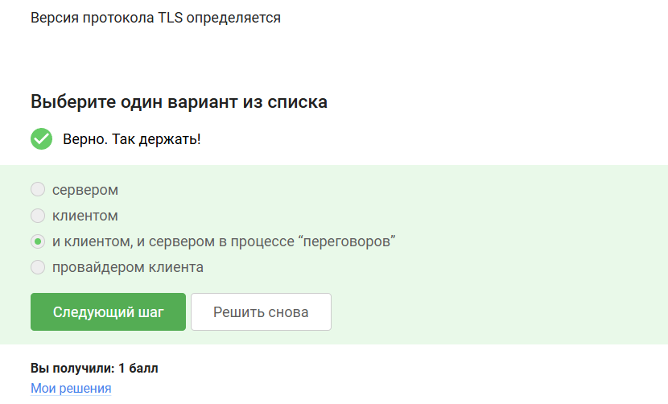{#fig-008 width=85%}

В фазе "рукопожатия" протокола TLS не предусмотрено шифрование данных ([рис. @fig-009]).

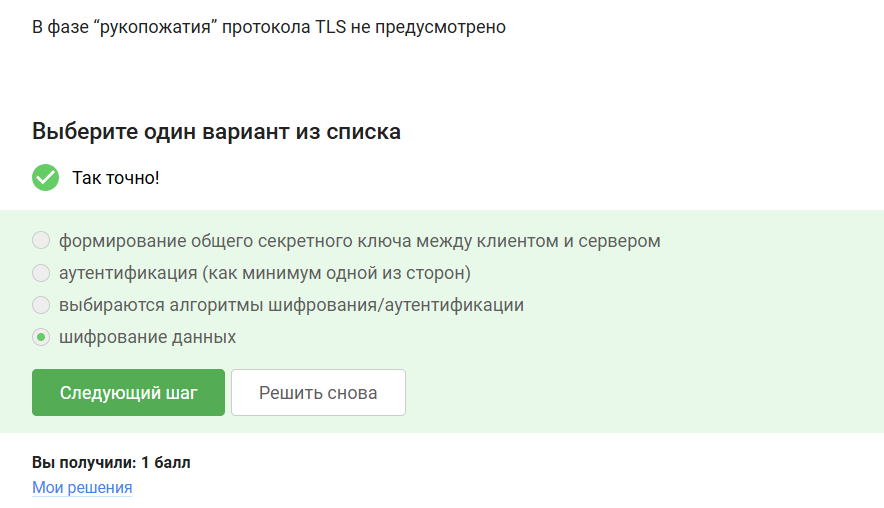{#fig-009 width=85%}

## Персонализация сети

Куки хранят: id сессии и идентификатор пользователя ([рис. @fig-0010]).

{#fig-0010 width=65%}

Куки не используются для улучшения надежности соединения ([рис. @fig-0011]).

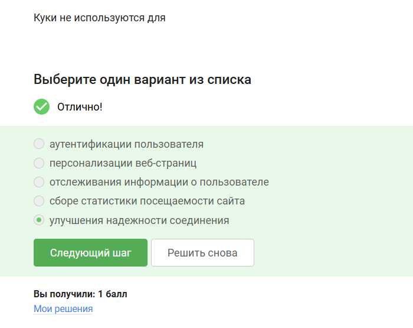{#fig-0011 width=70%}

Куки генерируются сервером, а не клиентом ([рис. @fig-0012]).

{#fig-0012 width=65%}

Сессионные куки хранятся в браузере на время пользования сайтом ([рис. @fig-0013]).

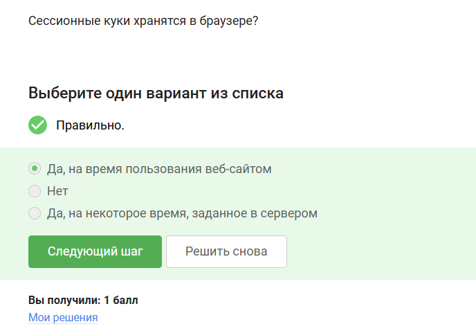{#fig-0013 width=70%}

## Браузер TOR. Анонимизация

В луковой сети TOR находится 3 промежуточных узла ([рис. @fig-0014]).

{#fig-0014 width=65%}

IP-адрес получателя известен отправителю и выходному узлу ([рис. @fig-0015]).

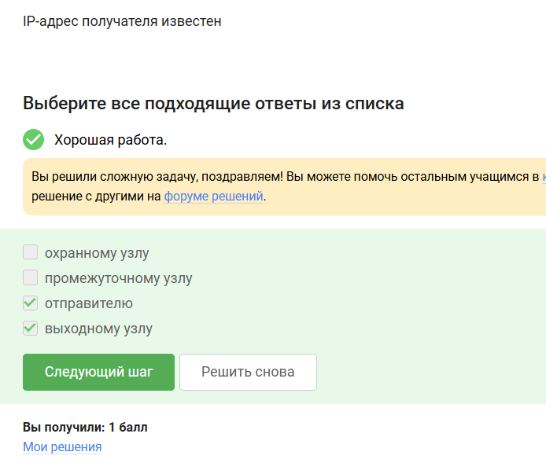{#fig-0015 width=70%}

Отправитель генерирует общий секретный ключ с охранным, промежуточным и выходным узлом ([рис. @fig-0016]).

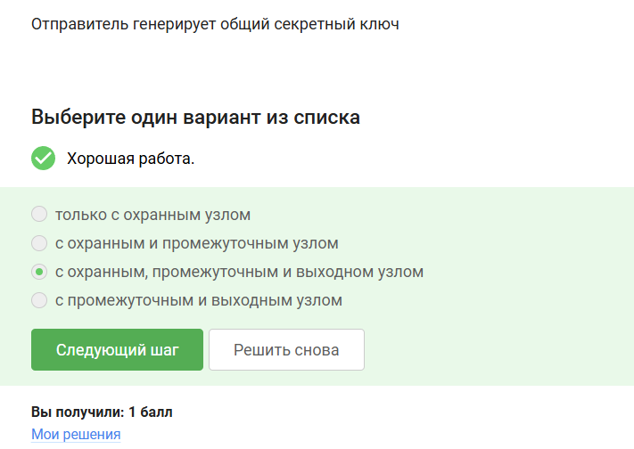{#fig-0016 width=70%}

Пользователь не должен использовать браузер TOR для успешного получения пакетов ([рис. @fig-0017]).

{#fig-0017 width=80%}

## Беспроводные сети Wi-fi

Wi-fi - это технология беспроводной локальной сети, работающая в соответствии со стандартом IEEE 802.11 ([рис. @fig-0018]).

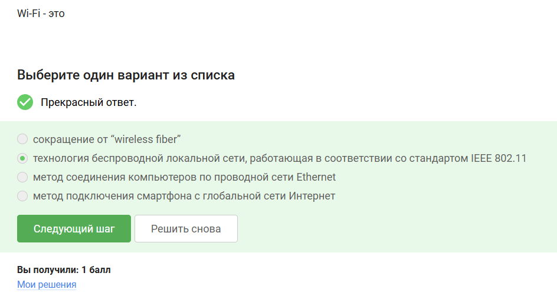{#fig-0018 width=80%}

Протокол Wi-fi работает на канальном уровне ([рис. @fig-0019]).

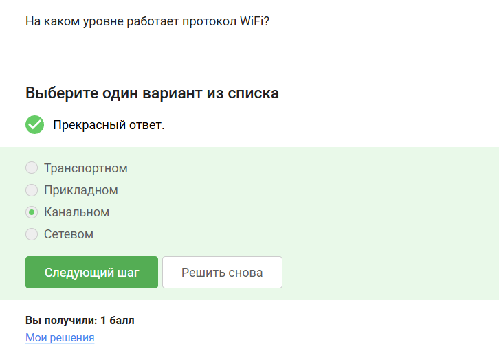{#fig-0019 width=80%}

WEP - небезопасный метод обеспечения шифрования и аутентификации в сети Wi-Fi ([рис. @fig-0020]).

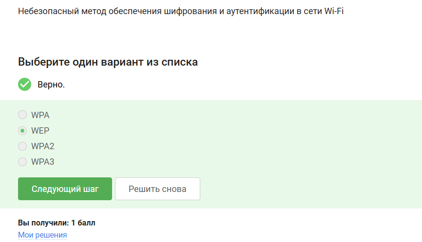{#fig-0020 width=85%}

Данные между хостом сети (компьютером и смартфоном) и роутером передаются в зашифрованном виде после аутентификации устройства ([рис. @fig-0021]).

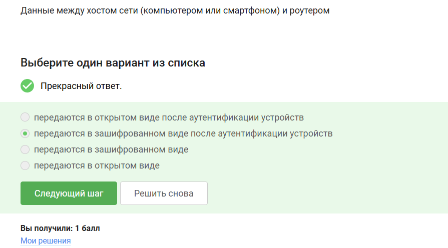{#fig-0021 width=85%}

Для домашней сети для аутентификации обычно используется метод WPA2 Personal ([рис. @fig-0022]).

{#fig-0022 width=80%}

# Выводы

В ходе прохождения раздела 1 внешнего курса были выполнены задания раздела 1 и была изучена характеристика безопасности в сети.

# Список литературы{.unnumbered}

::: {#refs}
:::
