---
## Author
author:
  name: Татьяна Александровна Пономарева
  affiliation:
    - name: Российский университет дружбы народов
      country: Российская Федерация
      postal-code: 115419
      city: Москва
      address: ул. Орджоникидзе, д. 3

## Title
title: "Отчёт по разделу №2 'Защита ПК/телефона' внешнего курса на тему: 'Основы кибербезопасности'"
subtitle: "Основы информационной безопасности"
license: "CC BY"
---

# Цель работы

Выполнить задания раздела 2 и понять, что входит в защиту ПК/телефона.

# Теоретическое введение

Данный курс рассчитан на любого пользователя ПК/смартфона/банкомата и состоит из 3-х разделов, также он содержит лекции, материалы для доп. чтения и тесты [@stepik_course].

# Выполнение заданий раздела 2 "Защита ПК/телефона"
## Шифрование диска

Загрузочный сектор диска можно зашифровать ([рис. @fig-001]).

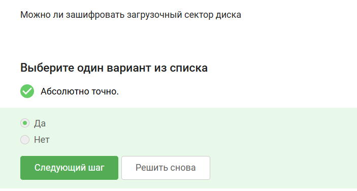{#fig-001 width=70%}

Шифрование диска основано на симметричном шифровании ([рис. @fig-002]).

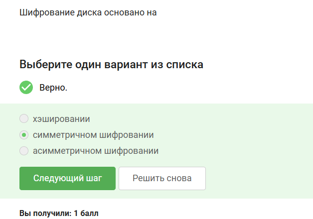{#fig-002 width=70%}

С помощью BitLocker и VeraCrypt можно зашифровать жесткий диск ([рис. @fig-003]).

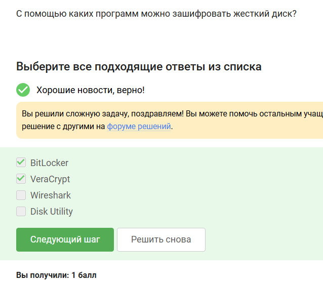{#fig-003 width=70%}

## Пароли

К стойкому паролю можно отнести UQr9@j4!S$ ([рис. @fig-004]).

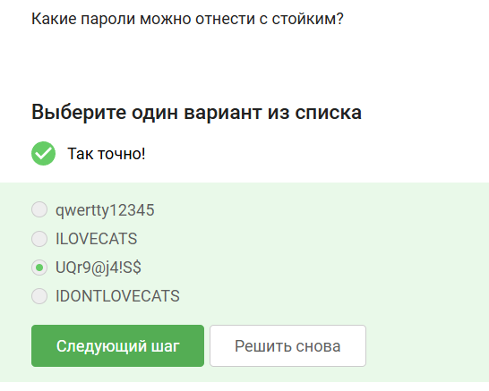{#fig-004 width=70%}

Пароли безопасно хранить в менеджерах паролей ([рис. @fig-005]).

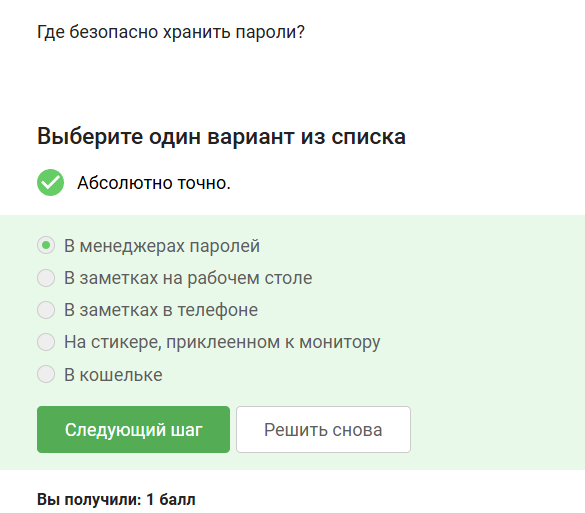{#fig-005 width=70%}

Капча нужна для защиты от автоматизированных атак, направленных на получение несанкционированного доступа ([рис. @fig-006]).

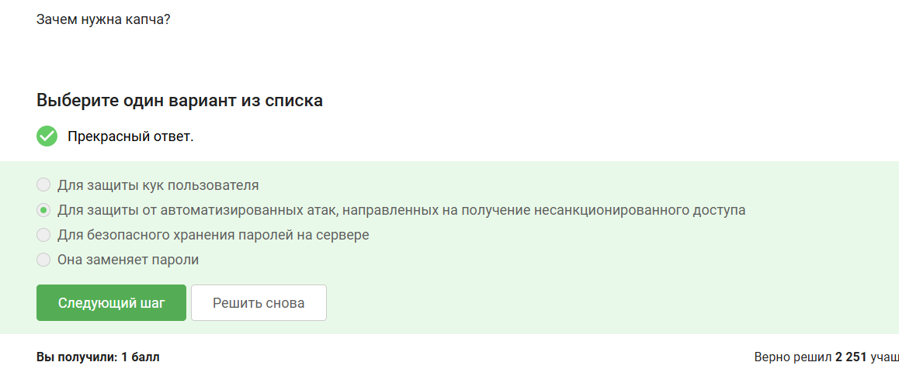{#fig-006 width=70%}

Хэширование паролей применяется для того, чтобы не хранить пароли на сервере в открытом виде ([рис. @fig-007]).

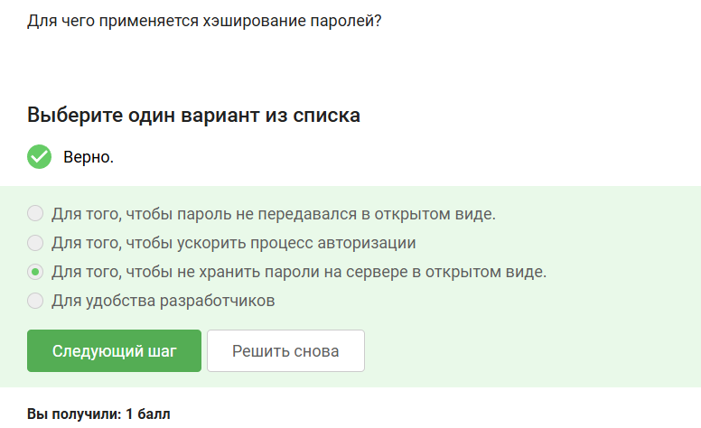{#fig-007 width=70%}

Если злоумышленник получил доступ к серверу, то соль для улучшения стойкости паролей к атаке перебором не поможет ([рис. @fig-008]).

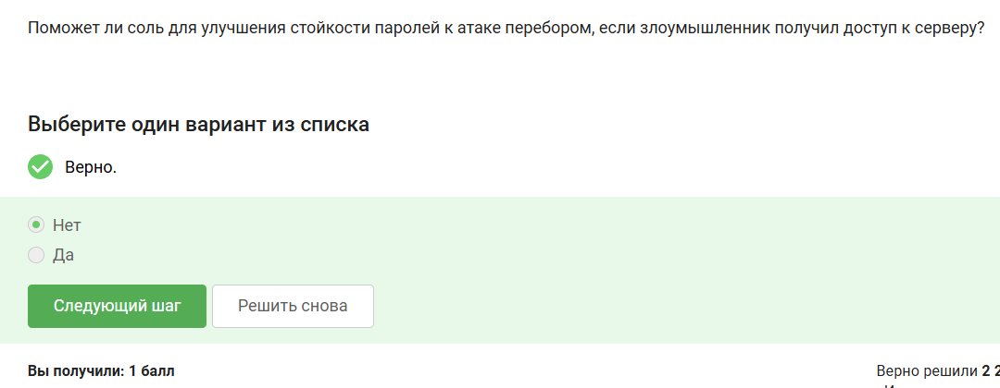{#fig-008 width=70%}

Меры защиты от утечек данных атакой перебором: разные пароли на всех сайтах, периодическая смена паролей, сложные(=длинные) пароли, капча ([рис. @fig-009]).

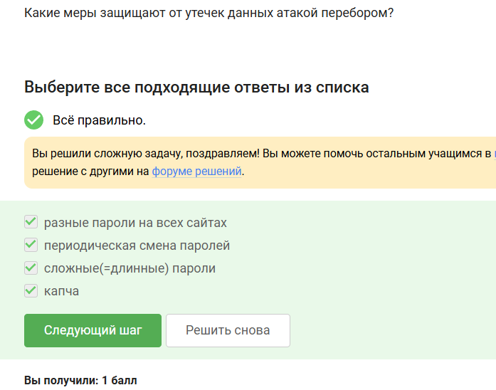{#fig-009 width=70%}

## Фишинг

Следующие ссылки являются фишинговыми, т к они маскируются под существующие сервисы и обманывают пользователей, забирая их данные ([рис. @fig-0010]).

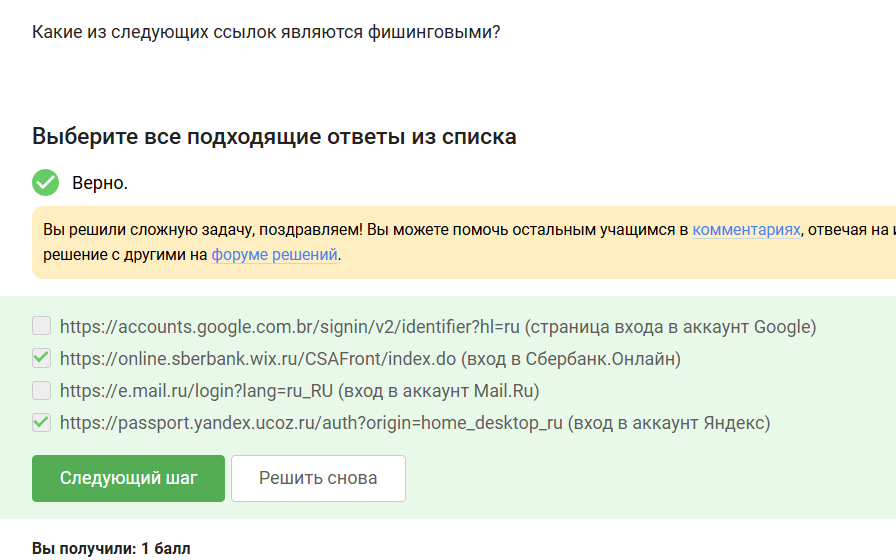{#fig-0010 width=70%}

Фишинговый имейл может прийти от знакомого адреса ([рис. @fig-0011]).

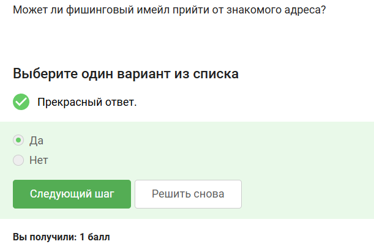{#fig-0011 width=70%}

## Вирусы. Примеры

Email Спуфинг - это подмена адреса отправителя в имейлах ([рис. @fig-0012]).

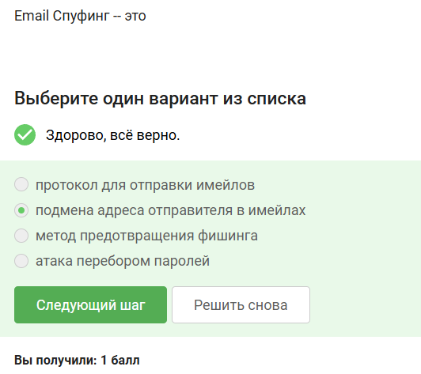{#fig-0012 width=70%}

Вирус-троян маскируется под легитимную программу ([рис. @fig-0013]).

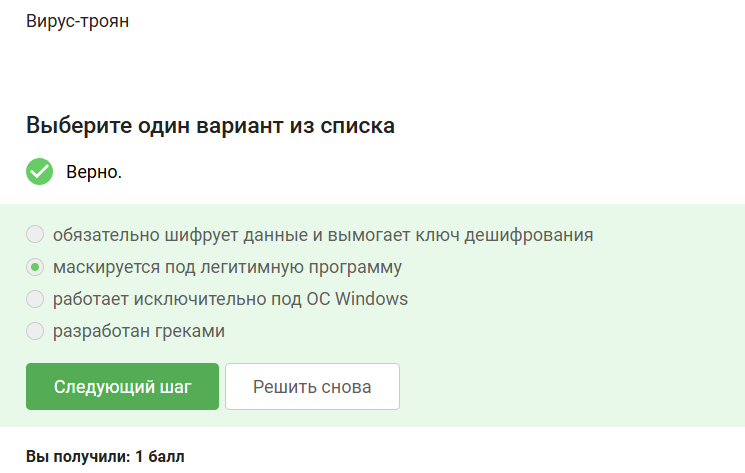{#fig-0013 width=70%}

## Безопасность мессенджеров

Ключ шифрования в протоколе мессенджеров Signal формируется при генерации первого сообщения стороной-отправителем ([рис. @fig-0014]).

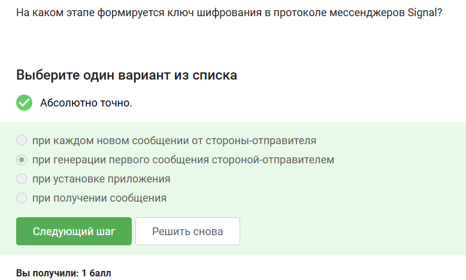{#fig-0014 width=70%}

Суть сквозного шифрования состоит в том, что сообщения передаются по узлам связи (серверам) в зашифрованном виде ([рис. @fig-0015]).

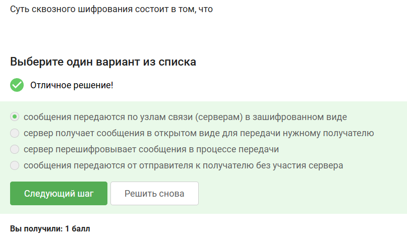{#fig-0015 width=70%}

# Выводы

В ходе прохождения раздела 2 внешнего курса были выполнены задания раздела 2 и была изучена характеристика защиты ПК/телефона.

# Список литературы{.unnumbered}

::: {#refs}
:::
