---
## Author
author:
  name: Татьяна Александровна Пономарева
  affiliation:
    - name: Российский университет дружбы народов
      country: Российская Федерация
      postal-code: 115419
      city: Москва
      address: ул. Орджоникидзе, д. 3

## Title
title: "Отчёт по разделу №3 'Криптография на практике' внешнего курса на тему 'Основы кибербезопасности'"
subtitle: "Основы информационной безопасности"
license: "CC BY"
---

# Цель работы

Выполнить задания раздела 3 и понять, что входит в криптографию на практике.

# Теоретическое введение

Данный курс рассчитан на любого пользователя ПК/смартфона/банкомата и состоит из 3-х разделов, также он содержит лекции, материалы для доп. чтения и тесты [@stepik_course].

# Выполнение заданий раздела 3 "Криптография на практике"

## Введение в криптографию

В асимметричных криптографических примитивах обе стороны имеют пару ключей ([рис. @fig-001]).

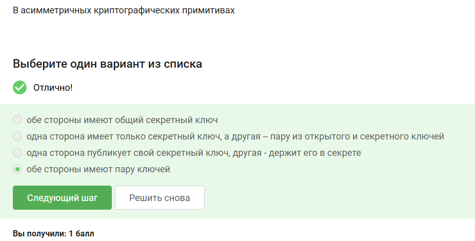{#fig-001 width=70%}

Криптографическая хэш-функция эффективно вычисляется, дает на выходе фиксированное число бит независимо от объема данных и стойкая к коллизиям ([рис. @fig-002]).

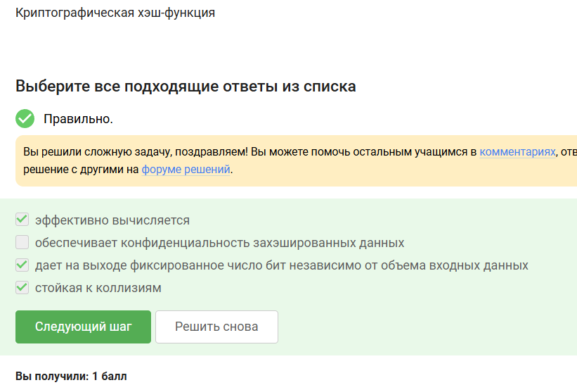{#fig-002 width=70%}

К алгоритмам цифровой подписи относятся RSA, ECDSA, ГОСТ Р 34.10-2012 ([рис. @fig-003]).

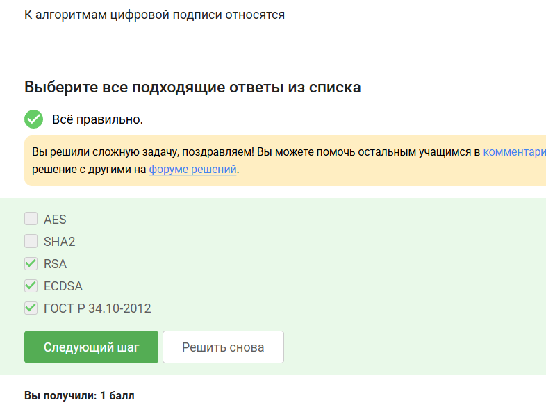{#fig-003 width=70%}

Код аутентификации сообщения относится к симметричным примитивам ([рис. @fig-004]).

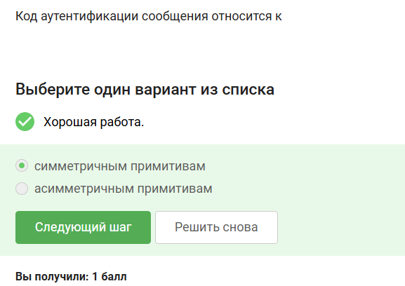{#fig-004 width=70%}

Обмен ключами Диффи-Хэллмана - это асимметричный примитив генерации общего секретного ключа ([рис. @fig-005]).

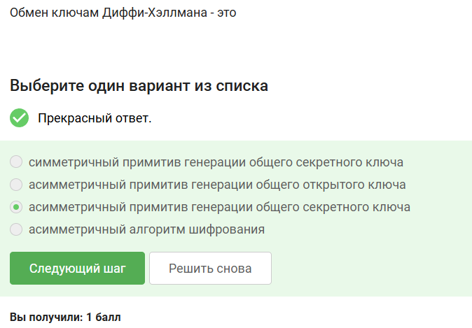{#fig-005 width=70%}

## Цифровая подпись

Протокол электронной подписи относится к протоколам с публичным (или открытым) ключом ([рис. @fig-006]).

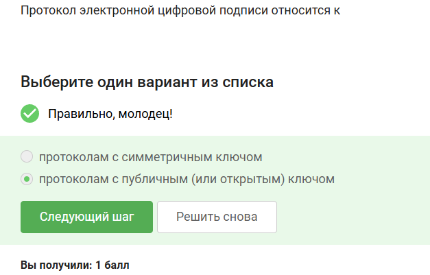{#fig-006 width=70%}

Алгоритм верификации электронной подписи требует на вход подпись, открытый ключ, сообщение ([рис. @fig-007]).

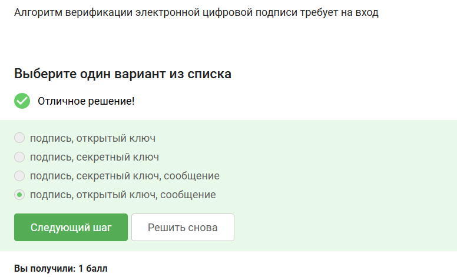{#fig-007 width=70%}

Электронная цифровая подпись не обеспечивает конфиденциальность ([рис. @fig-008]).

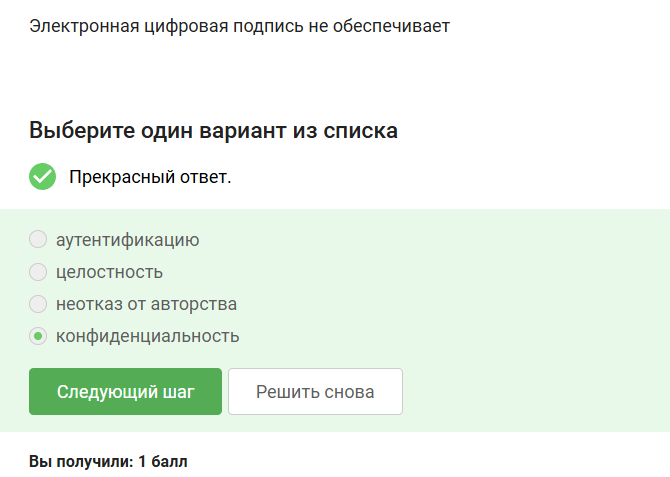{#fig-008 width=70%}

Усиленный квалифицированный тип сертификата электронной подписи понадобится для отправки налоговой отчетности в ФНС ([рис. @fig-009]).

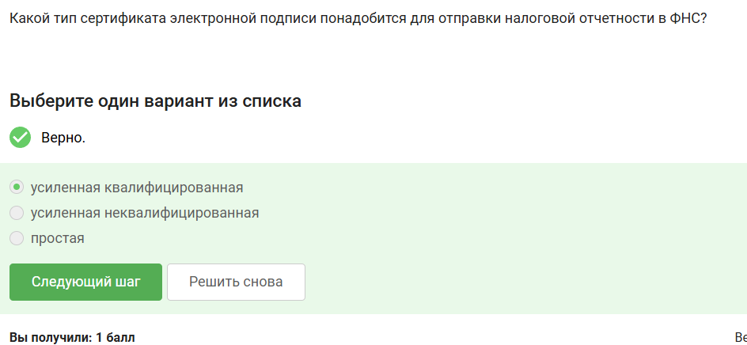{#fig-009 width=70%}

В удостоверяющем (сертификационном) центре можно получить квалифицированный сертификат ключа проверки электронной подписи ([рис. @fig-0010]).

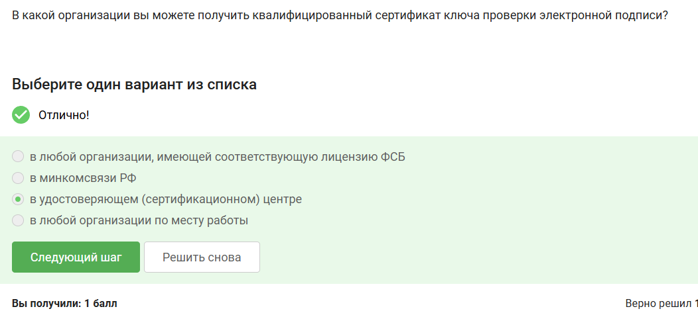{#fig-0010 width=70%}

## Электронные платежи

Платежные системы: MasterCard, МИР ([рис. @fig-0011]).

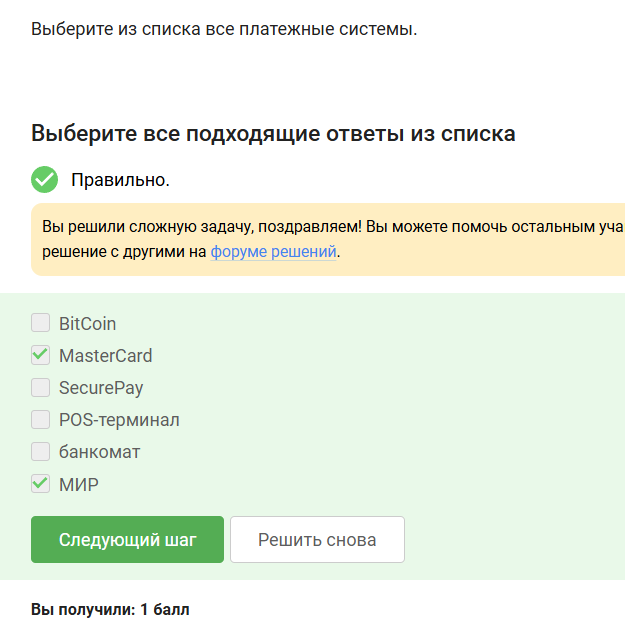{#fig-0011 width=70%}

Примеры многофакторной аутентификации: комбинация проверки пароля и кода в sms сообщении, комбинация кода в sms сообщении и отпечатка пальца ([рис. @fig-0012]).

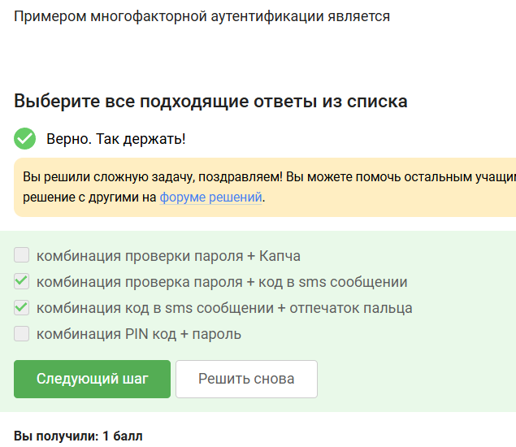{#fig-0012 width=70%}

При онлайн платежах сегодня используется многофакторная аутентификация покупателя перед банком-эмитентом ([рис. @fig-0013]).

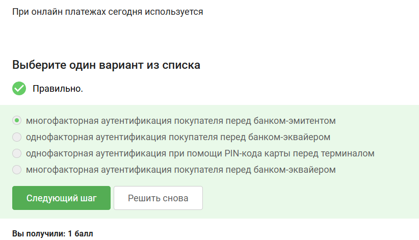{#fig-0013 width=70%}

## Блокчейн

Свойство криптографической хэш-функции, т е сложность нахождения прообраза, используется в доказательстве работы ([рис. @fig-0014]).

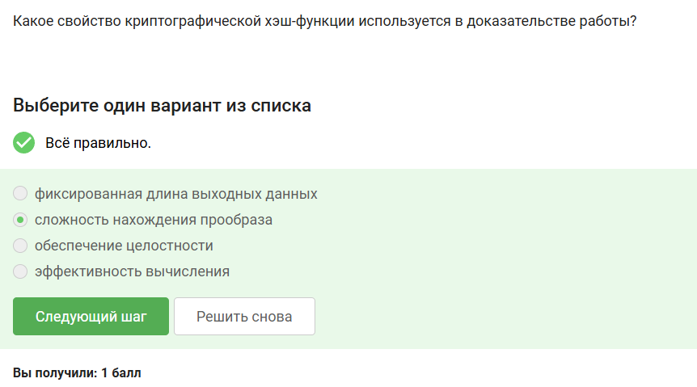{#fig-0014 width=70%}

Консенсус в некоторых системах блокчейн обладает свойствами консенсуса, постоянства, живучести, открытости ([рис. @fig-0015]).

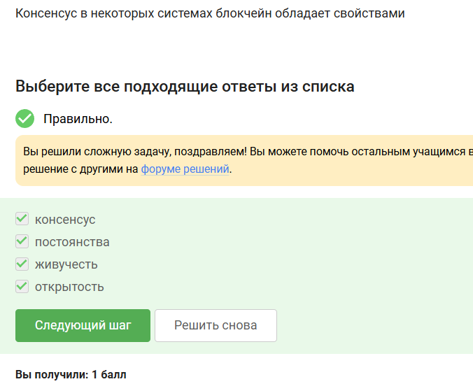{#fig-0015 width=70%}

Участники блокчейна хранят секретные ключи криптографического примитива цифровой подписи  ([рис. @fig-0016]).

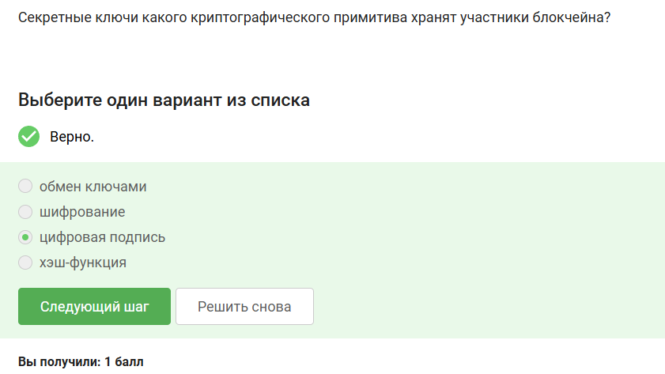{#fig-0016 width=70%}

# Выводы

В ходе прохождения раздела 3 внешнего курса были выполнены задания раздела 3 и была изучена тема криптографии на практике.

# Список литературы{.unnumbered}

::: {#refs}
:::
